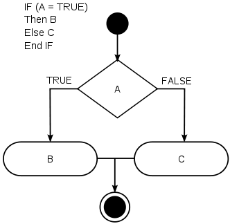
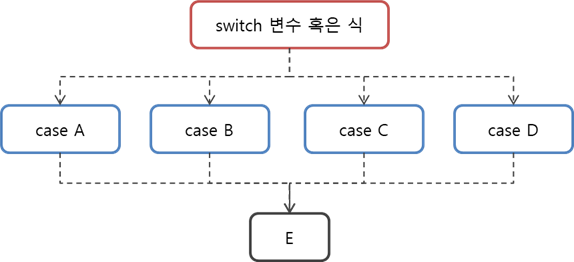

# Chap06 - 기본 제어문 (Control Statement)

## 6.1 `if` 문

`if`문은 분기문(branching statement)라고도 하며, 조건식을 기준으로 구문들의 절차상 흐름을 변경한다. 


### 6.1.1 기본 구조

`if`문의 구조는 아래의 그림과 같다. 




다음 예제코드를 통해`if`문의 사용법에 대해 알아보자. 아래의 코드는 사용자가 입력한 나이가 20 이상인지 비교한다. 결과가 참(`true`)이면 `if`문에 속한 나머지 구문을 수행하고 `false`이면 `if`문을 생략한다. 

```c
// ctrlbranch01.c

#include <stdio.h>

int main(void){

    int nAge = 0;

    printf("나이를 입력하세요. : ");
    scanf("%d", &nAge);

    // if문 시작
    if(nAge >= 20)
        // 조건식을 만족한 경우에만 실행하는 구문
        printf("당신의 나이는 %d세 입니다.\n", nAge);
    
    // if문 끝
    
    puts("End");

    return 0;
}
```


### 6.1.2 제어문과 스코프

만약`if`문에서 조건식을 만족할 때 수행할 구문이 여러 개면, 반드시 **스코프(Scope)**로 묶어야 한다. 위의 예제 코드에서는 수행할 구문이 하나이므로 스코프를 생략해도 된다.  아래의 예제코드는 사용자로부터 나이를 입력받고 `20`이상이면 사용자가 입력한 값을 `20`으로 바꿔주는 예제이다.

```c
// ctrlbranch02.c
#include <stdio.h>

int main(void){

    int nAge = 0;

    printf("나이를 입력하세요. : ");
    scanf("%d", &nAge);

    // if문의 시작
    if(nAge >= 20) {
        // 조건식을 만족했을 때 실행할 구문들
        // 여러 구문을 실행해야 한다면 반드시 블록 스코프로 묶는다.
        printf("처리 전, 당신의 나이는 %d세 입니다.\n", nAge);
        nAge = 20;
    }  // if 문 끝

    printf("당신의 나이는 %d세 입니다.\n", nAge);
    return 0;
}
```


## 6.2 `if else` 문

### 6.2.1 기본구조

`if else` 문은 조건을 만족하는 경우와 그렇지 않은 경우 모두를 처리할 수 있는 제어문이다.  [5장 - 연산자(응용)](https://github.com/ExcelsiorCJH/C-tutorials/tree/master/Chap05-Operator2) 에서 삼항연산자와 같은 방식이다. 아래의 예제 코드는 사용자가 입력한 값이 10 이하면 10으로, 그렇지 않으면 20으로 바꿔주는 예제이다.  코드에서 볼 수 있듯이 `else`문의 오른쪽에는 조건식을 쓰지 않는다.

```c
// ctrlifels01.c
#include <stdio.h>

int main(void){

    int nInput = 0, nSelect = 0;
    scanf("%d", &nInput);

    // nSelect = nInput <= 10 ? 10 : 20;
    // 삼항 연산자를 이용한 것과 동일한 구조의 if else 문
    if(nInput <= 10)
        nSelect = 10;  // true인 경우
    else
        nSelect = 20;  // false인 경우

    printf("%d\n", nSelect);
    return 0;
}
```


### 6.2.2 중첩된 제어문

제어문 내부에 다른 제어문을 통해 두 개 이상의 제어문을 한 덩어리로 묶은 것을 말한다. 즉, `if else`문 안에 또 다른 `if else`문이 있는 것이다. 다음 예제는 사용자가 입력한  값을 다음 세 가지 경우로 구별하는 코드다.

- **경우 1** : 0 미만
- **경우 2** : 10이하 0초과
- **경우 3** : 10 초과

```c
// ctrlifelse02.c
#include <stdio.h>

int main (void){

    int nInput = 0, nSelect = 0;
    scanf("%d", &nInput);

    // 1차 분류
    if(nInput <= 10){
        // 2차 분류
        if(nInput < 0)
            nSelect = 0;  // 경우 1
        else
            nSelect = 10;  // 경우 2
    } else {
        nSelect = 20;  // 경우 3
    }
    
    printf("%d\n", nSelect);
    return 0;
}
```


## 6.3 다중 if 문

다중 `if`문은 `if else`문 여러개를 연달아 붙여 작동하는 제어문이다. `if else` 문 안에 `if else`문을 쓰는 것이 아니라, `if` 문들을 순차적으로 쓴 형태를 말한다. 이러한 다중 `if`문에서 `else if` 문을 사용한다. 아래의 예제 코드는 `A, B, C, D, F` 다섯가지 학점을 점수에 따라 구분하는 코드다.

```c
// ctrlclassify02.c

#include <stdio.h>

int main(void){

    int nInput = 0;
    // 일단 A학점으로 설정한다.
    char ch = 'A';
    printf("점수를 입력하세요. : ");
    scanf("%d", &nInput);

    // 첫 번째 조건(A학점)에 맞는지 확인한다.
    if (nInput >= 90) 
        ch = 'A';

    // 아니라면 그 다음 수준에 맞는지 확인한다.
    else if (nInput >= 80)
        ch = 'B';

    // 같은 논리를 반복한다.
    else if (nInput >= 70)
        ch = 'C';
    else if (nInput >= 60)
        ch = 'D';
    // 앞선 조건에 부합하는 것이 하나도 없는 경우
    else
        ch = 'F';

    printf("점수 : %d, 학점: %c\n", nInput, ch);
    return 0;
}
```


## 6.4  `switch-case` 문

`switch-case`문은 다중 `if`문이나 중첩 `if`문처럼 정보를 '분류'하는데 사용하는 제어문이다. `switch-case`문은 `if`문과 달리 **단 한번의 연산(혹은 변수)으로 특정한 경우 하나를 선택**한다. 




```c
// switch-case문 구조
switch(변수 혹은 식){
    case 정수1:
        구문;
        break;
    case 정수2:
        구문;
        break;
    ......
    default:
    	구문;   
}
```


다음 예제는 `switch-case`문을 이용하여 산술 연산식을 문자열로 입력받고 연산결과를 출력하는 코드이다.

```c
// ctrlswitchcase01.c

#include <stdio.h>

int main(void){

    char cOperator = 0;
    int x = 0, y = 0, nResult = 0;

    // 사용자로부터 산술식을 입력받는다.
    scanf("%d%c%d", &x, &cOperator, &y);

    // 연산자가 무엇인지 선택한다.
    switch (cOperator){
        // cOperator == '+' 연산과 같다.
        case '+':
            nResult = x + y;
            // 다음 행으로 넘어가지 않고 switch-case 블록을 벗어난다.
            break;
        
        case '-':
            nResult = x - y;
            break;
        
        case '*':
            nResult = x * y;
            break;

        case '/':
            nResult = x / y;
            break;

        // 앞의 네 가지 경우에 해당하지 않는 나머지 경우
        default:
            puts("ERROR: 알 수 없는 산술 연산입니다.");
    }

    printf("Result: %d\n", nResult);
    return 0;
}
```

