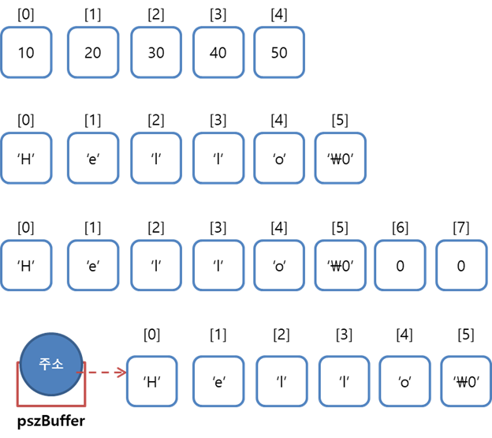

# Chap 08 - 배열 Array


배열(array)은 **형식이 같은 자료 여러 개가 모여 새로운 하나를 이룬 형식**이다. 예를 들어, `int aList[5]`는 5개의 의 `int`형 자료가 모여 `int`형 배열이 된다.  배열은 지금까지 배운 변수와 다르게 배열의 이름은 변수의 이름과 달리 **메모리의 주소**다. 

배열은 `배열이름[인덱스]` 형식을 가지며, 각 배열요소의 **인덱스는 0에서 부터 전체요소의 개수보다 1 작은(n-1) 범위까지**이다. 


아래의 예제는 다섯 개의 수를 입력받아 배열(`aList`)에 저장한 후 출력하는 코드이다. 아래의 예제 코드에서 확인할 수 있듯이,  `aList`는 **변수가 아니라 0번 요소의 주소** 즉, `&aList[0]` 이다.

```c
// array01.c
#include <stdio.h>

int main(void){

    // int 5개가 한 덩어리인 배열 선엄 및 0 초기화
    int aList[5] = { 0 };

    // 다섯 번 반복해 사용자 입력을 받고 순차적으로 인덱스를 
    // 증가시켜 각각의 배열요소에 저장한다. 
    for(int i=0; i < 5; ++i)
        scanf("%d", &aList[i]);

    // 배열에 담긴 내용을 요소 하나씩 꺼내서 출력한다.
    for (int i=0; i < 5; ++i)
        printf("%d\n", aList[i]);

    printf("aList = %d\n", aList);  // aList는 변수가 아니라 0번 요소의 주소이다.
    printf("&aList = %d\n", &aList);  // 즉 aList == aList[0]과 같다.

    return 0;
}
/* 출력결과
1 2 3 4 5
1
2
3
4
5
aList = 6422292
&aList = 6422292
*/
```


## 8.1 1차원 배열의 기본 문법

다음 예제는 1차원 배열의 활용 예제 코드이다. 이 예제에서 중요한 점은 **배열연산의 결과가 '[l-value](https://msdn.microsoft.com/ko-kr/library/bkbs2cds.aspx)가 될수 있다' 즉, 변수가 될 수 있다**는 것이다. 아래의 코드에서 `aList[0]` 과 `aList[3]`의 값이 각각 `100` 과 `200`으로 변경된 것을 확인 할 수 있다.

```c
// array02.c
#include <stdio.h>

int main(void){

    // 요소가 5개인 int형 배열의 선언 및 정의
    // int aList[] = { 10, 20, 30, 40, 50 };
    int aList[5] = { 10, 20, 30, 40, 50 };
    
    // 전체 요소의 값을 화면에 출력
    for(int i=0; i < 5; ++i)
        printf("%d\t", aList[i]);
    putchar('\n');

    // 일부 배열 요소의 값을 변경
    aList[0] = 100;
    aList[3] = 200;

    for(int i=0; i < 5; ++i)
        printf("%d\t", aList[i]);
    putchar('\n');

    return 0;
}

/*출력 결과
10	20	30	40	50	
100	20	30	200	50	
*/
```


다음 예제코드는 `aList`의 요소를 `aListNew`에 복사하는 코드이다. 아래 코드의 주석과 같이 `aListNew = aList`라고 할 경우, 에러가 난다. 그 이유는 `aListNew`의 값은 `&aListNew[0]`의 값 즉, 메모리 주소값이므로 **l-value**가 아니기 때문이다. 따라서, `aList`의 각 요소값을 복사하려면 `for` 문을 이용하여 하나씩 복사해야 한다.

```c
// arraycpy01.c
#include <stdio.h>

int main(void){

    int aList[5] = { 10, 20, 30, 40, 50 };
    int aListNew[5] = { 0 };

    // aListNew = aList;와 같은 코드는 불가능하며,
    // 아래와 같이 반복문으로 하나씩 복사해야 한다. (혹은 메모리 복사)
    for(int i=0; i<5; ++i)
        aListNew[i] = aList[i];

    for (int i = 0; i < 5; ++i)
        printf("%d\t", aListNew[i]);
    putchar('\n');

    return 0;
}
/*출력결과
10	20	30	40	50	
*/
```


## 8.2 문자열의 배열

**문자열은 본래 `char` 형 배열이다.** 그리고 **문자열의 끝은 `\0`(NULL 문자)** 이다. 


### 8.3.1 문자열의 기본 구조

다음 예제는 문자열의 본질이 배열임을 설명하는 코드이다.

```c
// arraystring01.c
#include <stdio.h>

int main(void){

    // 배열 각 요소의 값을 하나씩 기술하는 방식으로 초기화
    int aList[5] = { 30, 40, 10, 50, 20 };
    char szBuffer[6] = { 'H', 'e', 'l', 'l', 'o', '\0' };

    // 문자열 형태로 문자집합을 기술하는 방식으로 배열 초기화
    char szData[8] = { "Hello" };

    // 문자열 상수를 가리키는 포인터 변수 선언 및 초기화
    char *pszBuffer = "Hello";

    // 문자열은 모두 같은 방식으로 출력
    puts(szBuffer);
    puts(szData);
    puts(pszBuffer);

    return 0;
}
/* 출력결과
Hello
Hello
Hello
*/
```

아래의 그림은 위의 코드에서 문자열 배열의 논리적 메모리 구조를 나타낸 것이다. 




원래 `"Hello"`라는 문자열을 풀어서 표시하면, `'H', 'e', 'l', 'l', 'o', '\0'`이다. 문자상수 하나하나를 일일이 표기하려면 매우 번거롭기 때문에 보통은 문자열(`"Hello"`)로 표기한다.


### 8.3.2 문자열의 끝이 `'\0'`인 이유

[독하게 시작하는 C 프로그래밍]의 저자이신 최호성님의 전적인 사견임을 책에서도 밝혀 놓았듯이 명확한 정답은 있는 듯 하진 않지만, 공부하는 입장인 나로써는 충분히 일리가 있는 설명인듯하다.

다음 예제는 사용자로부터 영문이름을 입력받아 문자열의 길이를 출력하는 코드이다.

```c
// arraystring02.c
#include <stdio.h>

int main(void){

    char szBuffer[32] = { 0 };
    int nLength = 0;

    // 이름을 입력받아 배열에 저장한다.
    printf("Input your name : ");
    gets(szBuffer);

    // 배열의 시작부터 '\0'가 나올 때까지 계속 다음으로 넘기고 확인한다.
    while(szBuffer[nLength] != '\0')
        nLength++;

    // 이름과 문자열의 길이를 출력한다.
    printf("Your name is %s(%d).\n", szBuffer, nLength);
    return 0;
}
/*출력결과
Input your name : cjh
Your name is cjh(3).
*/
```

위의 코드에서 만약에 문자열 안에 `'\0'` 이 들어있지 않다면 무한루프가 발생할 수 있다. 하지만, 문자열의 끝에는 항상(?) `'\0'`이 들어 있으므로 위의 코드는 에러없이 동작한다. 