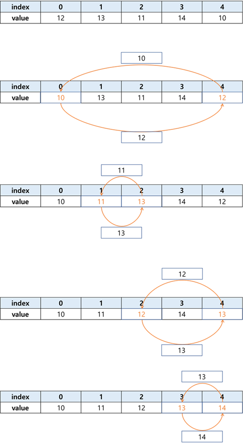

# Chap09 - 배열을 활용한 프로그래밍 기법


## 9.1 배열 요소의 정렬

정렬 알고리즘을 공부할 때 가장 기본이 되는 두 가지는 **선택정렬(selection sort)과 버블정렬(bubble sort)** 이다. 두 알고리즘 모두 반복문 두 개를 중첩하는 것만으로 구현할 수 있으며, 다른 정렬 알고리즘보다 구조가 단순하다.


### 9.1.1 선택정렬로 알려진 버블정렬

배열 전체 요소를 오름차순 정렬하는 가장 쉬운 방법은 **모두 정렬될 때까지 최소값을 구하는 것**이다. 만약 아래와 같이 5개인 배열을 오름차순으로 정렬하고자 한다면, 5개의 요소에서 최소값을 구해 **각 항을 교환하는 방식**으로 해당요소에 순차적으로 담는다.



```c
/* 
9-1. 선택정렬로 알려진 버블정렬 구현
*/

#include <stdio.h>

int main(void){

    int aList[5] = { 30, 40, 10, 50, 20 };
    int i = 0, j = 0, nTmp = 0;

    // 여기에 들어갈 코드 작성
    for(i = 0; i < 5; ++i){
        for(j = i; j < 5; ++j){
            if(aList[i] > aList[j]){
                nTmp = aList[i];
                aList[i] = aList[j];
                aList[j] = nTmp;
            }
        }
    }

    // 이하 코드는 수정하지 않음
    for(i = 0; i < 5; ++i)
        printf("%d\t", aList[i]);
    putchar('\n');
    return 0;
}
/*출력결과
10	20	30	40	50
*/
```


###  9.1.2 버블정렬 - Bubble Sort

**버블정렬(bubble sort)은 서로 연접한 두 항을 계속해서 비교하는 방식**으로 정렬한다. 아래의 그림*(출처: 위키피디아)* 은 버블정렬의 예를 보여준다. 그림에서 볼 수 있듯이, 버블정렬은 오름차순으로 정렬할 경우 가장 작은 값을 먼저 결정하는 것이 아니라, **가장 큰 값을 먼저 결정**한다.


```c
/* 
9-2. 버블정렬 구현
*/

#include <stdio.h>

int main(void){
    
    int aList[5] = { 30, 40, 10, 50, 20 };
    int i = 0, j = 0, nTmp = 0;

    // 여기에 들어갈 코드를 작성
    for(i = 4; i > 0; --i){
        for(j = 0; j < i; ++j){
            if(aList[j] > aList[j+1]){
                nTmp = aList[j];
                aList[j] = aList[j+1];
                aList[j+1] = nTmp;
            }
        }
    }

    // 이하 코드는 수정하지 않음
    for(i = 0; i < 5; ++i)
        printf("%d\t", aList[i]);
    putchar('\n');
    return 0;
}
```


### 9.1.3 선택정렬 - Selection Sort

선택정렬(selection sort)의 기본 원리는 [9.1.1 - 선택정렬로 알려진 버블정렬]과 같다. 한 가지 다른점은 '버블정렬'이나 '선택정렬로 알려진 버블정렬'처럼 값을 비교한 후 즉시 교환하는 것이 아니라,  **배열의 '인덱스(index)'를 따로 저장**한다. 그런다음 안쪽 반복문이 끝나면 교환 해준다. (그림 출처 : 위키피디아)


```c
/* 
9-3. 선택정렬 구현
*/

#include <stdio.h>

int main(void){
    
    int aList[5] = { 30, 40, 10, 50, 20 };
    int i = 0, j = 0, nMinIndex = 0, nTmp = 0;

    // 여기에 들어갈 코드를 작성
    for(i = 0; i < 5; ++i){
        nMinIndex = i;
        for(j = i; j < 5; ++j){
            if(aList[nMinIndex] > aList[j])
                nMinIndex = j;
        }

        if(nMinIndex != i){
            nTmp = aList[i];
            aList[i] = aList[nMinIndex];
            aList[nMinIndex] = nTmp;
        }
        
    }

    // 이하 코드는 수정하지 않음
    for (i = 0; i < 5; ++i)
        printf("%d\t", aList[i]);
    putchar('\n');
    return 0;
}
```

