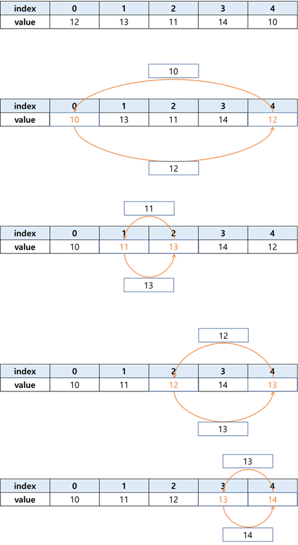

# Chap09 - 배열을 활용한 프로그래밍 기법


## 9.1 배열 요소의 정렬

정렬 알고리즘을 공부할 때 가장 기본이 되는 두 가지는 **선택정렬(selection sort)과 버블정렬(bubble sort)** 이다. 두 알고리즘 모두 반복문 두 개를 중첩하는 것만으로 구현할 수 있으며, 다른 정렬 알고리즘보다 구조가 단순하다.


### 9.1.1 선택정렬로 알려진 버블정렬

배열 전체 요소를 오름차순 정렬하는 가장 쉬운 방법은 **모두 정렬될 때까지 최소값을 구하는 것**이다. 만약 아래와 같이 5개인 배열을 오름차순으로 정렬하고자 한다면, 5개의 요소에서 최소값을 구해 **각 항을 교환하는 방식**으로 해당요소에 순차적으로 담는다.



```c
/* 
9-1. 선택정렬로 알려진 버블정렬 구현
*/

#include <stdio.h>

int main(void){

    int aList[5] = { 30, 40, 10, 50, 20 };
    int i = 0, j = 0, nTmp = 0;

    // 여기에 들어갈 코드 작성
    for(i = 0; i < 5; ++i){
        for(j = i; j < 5; ++j){
            if(aList[i] > aList[j]){
                nTmp = aList[i];
                aList[i] = aList[j];
                aList[j] = nTmp;
            }
        }
    }

    // 이하 코드는 수정하지 않음
    for(i = 0; i < 5; ++i)
        printf("%d\t", aList[i]);
    putchar('\n');
    return 0;
}
/*출력결과
10	20	30	40	50
*/
```


###  9.1.2 버블정렬 - Bubble Sort

**버블정렬(bubble sort)은 서로 연접한 두 항을 계속해서 비교하는 방식**으로 정렬한다. 아래의 그림*(출처: 위키피디아)* 은 버블정렬의 예를 보여준다. 그림에서 볼 수 있듯이, 버블정렬은 오름차순으로 정렬할 경우 가장 작은 값을 먼저 결정하는 것이 아니라, **가장 큰 값을 먼저 결정**한다.


```c
/* 
9-2. 버블정렬 구현
*/

#include <stdio.h>

int main(void){
    
    int aList[5] = { 30, 40, 10, 50, 20 };
    int i = 0, j = 0, nTmp = 0;

    // 여기에 들어갈 코드를 작성
    for(i = 4; i > 0; --i){
        for(j = 0; j < i; ++j){
            if(aList[j] > aList[j+1]){
                nTmp = aList[j];
                aList[j] = aList[j+1];
                aList[j+1] = nTmp;
            }
        }
    }

    // 이하 코드는 수정하지 않음
    for(i = 0; i < 5; ++i)
        printf("%d\t", aList[i]);
    putchar('\n');
    return 0;
}
```


### 9.1.3 선택정렬 - Selection Sort

선택정렬(selection sort)의 기본 원리는 [9.1.1 - 선택정렬로 알려진 버블정렬]과 같다. 한 가지 다른점은 '버블정렬'이나 '선택정렬로 알려진 버블정렬'처럼 값을 비교한 후 즉시 교환하는 것이 아니라,  **배열의 '인덱스(index)'를 따로 저장**한다. 그런다음 안쪽 반복문이 끝나면 교환 해준다. (그림 출처 : 위키피디아)


```c
/* 
9-3. 선택정렬 구현
*/

#include <stdio.h>

int main(void){
    
    int aList[5] = { 30, 40, 10, 50, 20 };
    int i = 0, j = 0, nMinIndex = 0, nTmp = 0;

    // 여기에 들어갈 코드를 작성
    for(i = 0; i < 5; ++i){
        nMinIndex = i;
        for(j = i; j < 5; ++j){
            if(aList[nMinIndex] > aList[j])
                nMinIndex = j;
        }

        if(nMinIndex != i){
            nTmp = aList[i];
            aList[i] = aList[nMinIndex];
            aList[nMinIndex] = nTmp;
        }
        
    }

    // 이하 코드는 수정하지 않음
    for (i = 0; i < 5; ++i)
        printf("%d\t", aList[i]);
    putchar('\n');
    return 0;
}
```


## 9.2 배열과 교차의 구현

아래의 그림과 같이 한번의 열의 인덱스 증가방향과 일치하고 다음 한 번은 반대가 되도록 숫자를 배열에 넣어보도록 하자.


이러한 배열을 구현하는데는 여러가지 방법이 있다. 먼저 내가 구현한 코드를 보고 교재에서 구현한 방법들을 차례대로 살펴보도록 하자.


### 9.2.1 내가 구현한 코드

나는 홀수행과 짝수행을 나눠 짝수행(0, 2, 4)에는 순차적으로 채우고 홀수행(1, 3, 5)에는 역방향으로 채워주도록 코드를 작성했다.

```c
/* 
지그재그로 2차원 배열 채우기
*/
#include <stdio.h>

int main(void){

    int aList[5][5] = {0};
    int i = 0, j = 0, cnt = 0;
    
    for(i = 0; i < 5; i=i+2){
        for(j = 0; j < 5; ++j)
            aList[i][j] = (5 * i) + (j + 1);
    }
    for(i = 1; i < 5; i=i+2){
        ++cnt;
        for(j = 4; j >= 0; --j)
            aList[i][j] = (10 * cnt) - j;
    }

    for(i = 0; i < 5; ++i){
        for (j = 0; j < 5; ++j)
            printf("%d\t", aList[i][j]);
        putchar('\n');
    }
        
    return 0;
}
/*출력결과
1	2	3	4	5	
10	9	8	7	6	
11	12	13	14	15	
20	19	18	17	16	
21	22	23	24	25
*/
```


### 9.2.2 행 인덱스를 2로 나눈 나머지를 비교

내가 작성한 코드랑 거의 비슷하지만 `if`문을 이용하여 행 인덱스를 2로 나눈 나머지를 비교해 홀수행과 짝수행으로 나눠 배열을 채워 넣었다.

```c
// arraycross02.c

#include <stdio.h>

int main(void){

    int aList[5][5] = { 0 };
    int i = 0, j = 0, nCounter = 0;

    for(i = 0; i < 5; ++i){
        // 짝수 행과 홀수 행을 구별한다.
        if(i % 2 == 0)  // 짝수
            for(j = 0; j < 5; ++j)
                aList[i][j] = ++nCounter;
        else  // 홀수
            for(j = 0; j < 5; ++j)
                aList[i][4-j] = ++nCounter;
    }

    for (i = 0; i < 5; ++i){
        for (j = 0; j < 5; ++j)
            printf("%d\t", aList[i][j]);
        putchar('\n');
    }

    return 0;
}
/*출력결과
1	2	3	4	5	
10	9	8	7	6	
11	12	13	14	15	
20	19	18	17	16	
21	22	23	24	25
*/
```


### 9.2.3 플래그(Flag)를 적용한 교차 구현

이번에는 플래그(flag)라는 개념을 적용하여 교차를 구현한다. (토글)스위치를 작동시키는 것 처럼 짝수항일때는 `nFlag=1` 인 스위치(부분)가 작동하고, 홀수항일때는 `nFlag=0` 인 스위치가 작동한다.

```c
// arraycross03.c

#include <stdio.h>

int main(void){

    int aList[5][5] = { 0 };
    // nFlag변수는 반복문 내부에서 매번 참/거짓으로 바뀐다.
    int i = 0, j = 0, nCounter = 0, nFlag = 1;

    for (i = 0; i < 5; ++i){
        // 토글을 위한 nFlag변수
        if(nFlag){
            // 정방향 채우기
            for (j = 0; j < 5; ++j)
                aList[i][j] = ++nCounter;
            // 다음 반복에서 거짓인 경우가 선택 되도록 한다.
            nFlag = 0;
        } else {
            // 역방향 채우기
            for (j = 0; j < 5; ++j)
                aList[i][4 - j] = ++nCounter;
            // 다음 반복에서 참인 경우가 선택되도록 한다.
            nFlag = 1;
        }
    }

    for (i = 0; i < 5; ++i){
        for (j = 0; j < 5; ++j)
            printf("%d\t", aList[i][j]);
        putchar('\n');
    }

    return 0; 
}
/*출력결과
1	2	3	4	5	
10	9	8	7	6	
11	12	13	14	15	
20	19	18	17	16	
21	22	23	24	25
*/
```


## 9.3 달팽이 배열 채우기

아래의 그림과 같이 시계방향으로 달팽이 모양처럼 숫자를 배열에 넣어보자.


```c
/* 
9-4. 달팽이 배열 채우기
*/
#include <stdio.h>

int main(void){

    int aList[5][5] = { 0 };
    int x = -1, y = 0, nCounter = 0;
    int i = 0, j = 0, nLength = 9, nDirection = 1;

    for(nLength = 9; nLength > 0; nLength -= 2){
        for (i = 0; i < nLength; ++i){
            if(i < nLength/2 + 1)
                x += nDirection;
            else
                y += nDirection;
            
            aList[y][x] = ++nCounter;
        }

        nDirection = -nDirection;
    }
    
    for (i = 0; i < 5; ++i){
        for (j = 0; j < 5; ++j)
            printf("%d\t", aList[i][j]);
        putchar('\n');
    }

    return 0; 
}
/*출력결과
1	2	3	4	5	
16	17	18	19	6	
15	24	25	20	7	
14	23	22	21	8	
13	12	11	10	9
*/
```


## 9.4 Lookup 배열

9.1 ~ 9.3 까지 배운 내용은 메모리를 활용하는 방법으로서의 배열에 대해 알아 보았다. 이번 절에서는 `switch-case` 나 다중 `if` 문을 활용한 단계별 분류를 시도하는 것처럼 **선택이라는 개념을 구현하는 데 배열을 사용**해 본다. 

아래의 예제는 Lookup 배열을 이용하여 요금계산을 하는 코드이다. 이 예제처럼 **정보검색 기능을 제공할 목적으로 사용된 배열을 `Lookup 배열`** 이라고 한다.

```c
// arraylookup01.c

#include <stdio.h>

int main(void){

    // 전체 경우에 대한 과금률 결과를 담은 배열의 선언 및 정의
    double aRate[10] = {
        0.0, 0.1, 0.25,  // 1~3세 0%, 10%, 25%
        0.5, 0.5,  // 4~5세
        0.6, 0.65,  // 6~7세
        0.8, 0.82, 0.97  // 8~10세
    };
    int nAge = 0, i = 0, nFee = 1000;

    // 요금표를 출력한다.
    printf("요금표\n");
    for(i = 1; i <= 10; ++i)
        printf("%d세 요금 : \t%d원\n", i, (int)(nFee * aRate[i - 1]));
    putchar('\n');

    // 나이를 입력받고 배열 인덱스 범위 내부로 값을 강제 조정한다.
    printf("나이를 입력하세요. : ");
    scanf("%d", &nAge);
    if(nAge < 1)
        nAge = 1;
    else if (nAge > 10)
        nAge = 10;

    // 나이에 맞는 배열요소를 선택하고 별다른 제어문 없이 즉시 값을 출력한다.
    printf("최종요금: %d원\n", (int)(nFee * aRate[nAge - 1]));
    putchar('\n');
    return 0;
}

/*출력 결과
요금표
1세 요금 : 	0원
2세 요금 : 	100원
3세 요금 : 	250원
4세 요금 : 	500원
5세 요금 : 	500원
6세 요금 : 	600원
7세 요금 : 	650원
8세 요금 : 	800원
9세 요금 : 	820원
10세 요금 : 	970원

나이를 입력하세요. : 7
최종요금: 650원
*/
```

