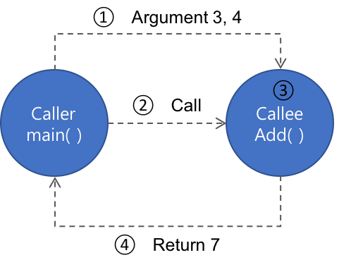

# Chap10 - 함수에 대한 기본 이론

> 함수는 C언어 프로그램을 이루는 핵심이라고 할 수 있다. 각종 연산식이 모여 한 구문을 이루고, 다시 여러구문이 의미있는 절차상의 흐름을 만들고, 그 절차상의 흐름이 하나로 뭉쳐 함수를 이루고, 다시 함수가 함수를 호출하여 연계하고 또 다른 흐름을 만듦으로써 C언어 기반의 프로그램이 완성된다.

함수와 반복문은 반복되는 코드들을 처리하는 것과 관련된 문법이다. 반복문은 연속적인 반복을 의미하고, **함수는 불연속적인 반복을 통한 코드 재사용을 의미** 한다.


## 10.1 사용자 정의 함수의 선언 및 정의

**사용자 정의 함수(user-defined function)** 는 기존의 표준 입/출력 함수(ex. `getchar()/putchar()`)들과 달리 사용자(개발자)가 스스로 만들어낸 함수를 의미한다. 즉, **특정 사용자 정의 함수의 내부 절차적 흐름을 정의(혹은 기술)한 것** 이다.

다음 예제는 `Add()` 라는 두 정수를 덧셈하는 기능을 가진 함수를 만드는 코드이다.

```c
// function01.c
#include <stdio.h>

// 사용자 정의 함수의 선언 및 정의
// int 형식 자료 둘을 매개변수로 받아 합산결과를 반환
int Add(int a, int b){
    // Add() 함수의 지역변수 선언 및 정의
    int nData = 0;
    nData = a + b;

    // 합산 결과를 호출자 함수에 반환한다.
    return nData;
}

int main(void){

    int nResult = 0;

    // Add() 함수를 실인수 3과 4로 확정해 호출하고 결과를
    // 반환받아 nResult에 저장한다.
    nResult = Add(3, 4);
    printf("Result: %d\n", nResult);
    return 0;
}
/*출력결과
Result: 7
*/
```

위의 코드에서 `Add()` 함수는 아래의 그림처럼,  `int` 형 정보 둘을 매개변수로 받고 다시 `int` 형 정보를 호출자 함수에 반환하는 함수다. 




함수의 **매개변수와 반환 자료형**은 함수의 사용방법을 결정한다. 매개변수의 개수가 많아지면 호출자는 명시해야 할 인수가 그만큼 늘어나므로 함수가 복잡해질 수 있다. 따라서, 불필요하게 매개변수를 늘리는 것은 바람직하지 않다. 

또한, **프로그램의 시작은 언제나 `main()`함수** 이다. 따라서, 위의 예제코드 `function01.c`에서는 `Add()` 함수가 `main()` 함수보다 위에 기술되어 있지만,  프로그램 실행시 무조건 `main()` 함수부터 시작한다. 


### 10.1.1 매개변수 (Parameter)

함수의 '매개변수(parameter)'는 **호출자와 피호출자 함수를 연결해주는 매개체**이다. 모든 **호출자 함수는 피호출자 함수 매개변수의 초기값을 '실인수'로 명시** 해야한다. 매개변수는 피호출자 함수 내부에 선언된 **지역변수** 이므로 피호출자 함수 내부에 같은 이름을 가진 변수가 명시될 수 없다.

```c
// functionerror.c

#include <stdio.h>

int Add(int a, int b){
    int nData = 0, a;
    nData = a + b;
    a = b = 10;
    return nData;
}
/* 출력결과
error: redefinition of 'a'
*/
```


### 10.1.2 반환 자료형

함수의 반환 자료형은 **호출자 함수가 피호출자 함수를 호출해서 얻을 수 있는 정보의 형식**이다. (피호출자)함수가 반환한 자료는 연산의 '[임시결과](http://excelsior-cjh.tistory.com/136?category=999958)' 처럼 즉시 활용하거나 저장하지 않으면 유실된다.

여기서 '즉시 활용'은 다음과 같다.

- 자료형이 일치하는 **변수에 대입하여 정보를 보관**
- 피연산자로 다른 연산에 참여
- 다른 함수를 호출하는 데 인수로 사용

다음 예제는 사용자 정의 함수인 `GetMax()` 함수는 `int` 형 정수 세 개를 매개변수로 받아 최대값을 구하고 `int` 형 자료로 반환하는 함수다. 이 예제에서 위의 세 가지 '즉시 활용'을 확인할 수 있다.

```c
// function03.c

#include <stdio.h>

// 정수 셋을 매개변수로 받고 최대값을 반환하는 함수 선언 및 정의
int GetMax(int a, int b, int c){
    // GetMax() 함수의 지역변수 선언 및 정의
    int nMax = a;
    if (b > nMax) nMax = b;
    if (c > nMax) nMax = c;

    return nMax;
}

int main(void){

    int nResult = 0;

    // 함수가 반환한 값을 %d 형식으로 출력한다.
    printf("MAX: %d\n", GetMax(1, 2, 3));
    // 함수가 반환한 값에 *2 연산을 수행하고 %d 형식으로 출력한다.
    printf("MAX: %d\n", GetMax(2, 3, 1) * 2);

    // 함수가 반환한 값을 nResult 변수에 저장한 후
    // nResult에 저장된 값을 %d 형식으로 출력한다.
    printf("MAX: %d\n", nResult = GetMax(3, 1, 2));
    return 0;
}
/* 출력결과
MAX: 3
MAX: 6
MAX: 3
*/
```


## 10.2 두 가지 함수 설계 원칙

프로그래머가 해야할 고민은 **무엇을(어떤 기능을 수행하는) 함수로 만들어야 하는가** 이다. [독하게 시작하는 C 프로그래밍] 저자이신 최호성님은 다음과 같이 제안한다.

> - 사용자 인터페이스(겉으로 드러나는 외형)와 내부기능은 반드시 분리할 것
> - 하나의 단위기능으로 규정할 수 있는 대상은 함수로 만들 것


### 10.2.1 UI와 기능의 분리

인터페이스가 아예 없는 프로그램이 아니라면 모든 프로그램은 **UI와 기능**으로 나눌 수 있다. 이 둘은 적어도 함수단위로 구별되어야 한다. 

아래의 예제는 계승(factorial)을 계산하는 함수를 구현한 코드이다. 피호출자 함수 `GetFactorial()` 는 `int` 형 매개변수를 통해 계승을 구할 숫자를 받는다. 그리고 화면에 출력할 부분은 `main()` 함수에 정의한다. 

```c
// funcdesign02.c

#include <stdio.h>

// 계승을 구하는 기능은 있지만 메시지를 출력하지 않는다.
int GetFactorial(int nParam){
    
    int nResult = 1, i = 0;
    // 매개변수 값이 유효하지 않다면 0을 반환함으로써
    // 호출자 함수에 오류를 알린다!
    if (nParam < 1 || nParam > 10) return 0;

    for(i = 1; i <= nParam; ++i)
        nResult *= i;
    return nResult;
}

// 화면 출력과 관련한 코드는 모두 main() 함수가 담당한다.
int main(void){

    int nResult = 0, nInput = 0;

    printf("계승을 구할 정수(1~10)를 입력하세요. : ");
    scanf("%d", &nInput);

    // 반환값을 확인해 오류와 정상을 식별하고 대응할 수 있다.
    nResult = GetFactorial(nInput);
    if(nResult == 0){
        puts("ERROR: 1~10사이의 정수를 입력하세요.");
        return 0;
    }
    printf("Result: %d\n", nResult);
    return 0;
}
/* 출력결과
계승을 구할 정수(1~10)를 입력하세요. : 11
ERROR: 1~10사이의 정수를 입력하세요.
*/
```


