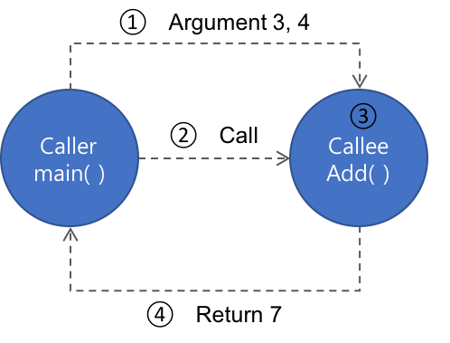

# Chap10 - 함수에 대한 기본 이론

> 함수는 C언어 프로그램을 이루는 핵심이라고 할 수 있다. 각종 연산식이 모여 한 구문을 이루고, 다시 여러구문이 의미있는 절차상의 흐름을 만들고, 그 절차상의 흐름이 하나로 뭉쳐 함수를 이루고, 다시 함수가 함수를 호출하여 연계하고 또 다른 흐름을 만듦으로써 C언어 기반의 프로그램이 완성된다.

함수와 반복문은 반복되는 코드들을 처리하는 것과 관련된 문법이다. 반복문은 연속적인 반복을 의미하고, **함수는 불연속적인 반복을 통한 코드 재사용을 의미** 한다.


## 10.1 사용자 정의 함수의 선언 및 정의

**사용자 정의 함수(user-defined function)** 는 기존의 표준 입/출력 함수(ex. `getchar()/putchar()`)들과 달리 사용자(개발자)가 스스로 만들어낸 함수를 의미한다. 즉, **특정 사용자 정의 함수의 내부 절차적 흐름을 정의(혹은 기술)한 것** 이다.

다음 예제는 `Add()` 라는 두 정수를 덧셈하는 기능을 가진 함수를 만드는 코드이다.

```c
// function01.c
#include <stdio.h>

// 사용자 정의 함수의 선언 및 정의
// int 형식 자료 둘을 매개변수로 받아 합산결과를 반환
int Add(int a, int b){
    // Add() 함수의 지역변수 선언 및 정의
    int nData = 0;
    nData = a + b;

    // 합산 결과를 호출자 함수에 반환한다.
    return nData;
}

int main(void){

    int nResult = 0;

    // Add() 함수를 실인수 3과 4로 확정해 호출하고 결과를
    // 반환받아 nResult에 저장한다.
    nResult = Add(3, 4);
    printf("Result: %d\n", nResult);
    return 0;
}
/*출력결과
Result: 7
*/
```

위의 코드에서 `Add()` 함수는 아래의 그림처럼,  `int` 형 정보 둘을 매개변수로 받고 다시 `int` 형 정보를 호출자 함수에 반환하는 함수다. 




함수의 **매개변수와 반환 자료형**은 함수의 사용방법을 결정한다. 매개변수의 개수가 많아지면 호출자는 명시해야 할 인수가 그만큼 늘어나므로 함수가 복잡해질 수 있다. 따라서, 불필요하게 매개변수를 늘리는 것은 바람직하지 않다. 

또한, **프로그램의 시작은 언제나 `main()`함수** 이다. 따라서, 위의 예제코드 `function01.c`에서는 `Add()` 함수가 `main()` 함수보다 위에 기술되어 있지만,  프로그램 실행시 무조건 `main()` 함수부터 시작한다. 


### 10.1.1 매개변수 (Parameter)

함수의 '매개변수(parameter)'는 **호출자와 피호출자 함수를 연결해주는 매개체**이다. 모든 **호출자 함수는 피호출자 함수 매개변수의 초기값을 '실인수'로 명시** 해야한다. 매개변수는 피호출자 함수 내부에 선언된 **지역변수** 이므로 피호출자 함수 내부에 같은 이름을 가진 변수가 명시될 수 없다.

```c
// functionerror.c

#include <stdio.h>

int Add(int a, int b){
    int nData = 0, a;
    nData = a + b;
    a = b = 10;
    return nData;
}
/* 출력결과
error: redefinition of 'a'
*/
```


### 10.1.2 반환 자료형

함수의 반환 자료형은 **호출자 함수가 피호출자 함수를 호출해서 얻을 수 있는 정보의 형식**이다. (피호출자)함수가 반환한 자료는 연산의 '[임시결과](http://excelsior-cjh.tistory.com/136?category=999958)' 처럼 즉시 활용하거나 저장하지 않으면 유실된다.

여기서 '즉시 활용'은 다음과 같다.

- 자료형이 일치하는 **변수에 대입하여 정보를 보관**
- 피연산자로 다른 연산에 참여
- 다른 함수를 호출하는 데 인수로 사용

다음 예제는 사용자 정의 함수인 `GetMax()` 함수는 `int` 형 정수 세 개를 매개변수로 받아 최대값을 구하고 `int` 형 자료로 반환하는 함수다. 이 예제에서 위의 세 가지 '즉시 활용'을 확인할 수 있다.

```c
// function03.c

#include <stdio.h>

// 정수 셋을 매개변수로 받고 최대값을 반환하는 함수 선언 및 정의
int GetMax(int a, int b, int c){
    // GetMax() 함수의 지역변수 선언 및 정의
    int nMax = a;
    if (b > nMax) nMax = b;
    if (c > nMax) nMax = c;

    return nMax;
}

int main(void){

    int nResult = 0;

    // 함수가 반환한 값을 %d 형식으로 출력한다.
    printf("MAX: %d\n", GetMax(1, 2, 3));
    // 함수가 반환한 값에 *2 연산을 수행하고 %d 형식으로 출력한다.
    printf("MAX: %d\n", GetMax(2, 3, 1) * 2);

    // 함수가 반환한 값을 nResult 변수에 저장한 후
    // nResult에 저장된 값을 %d 형식으로 출력한다.
    printf("MAX: %d\n", nResult = GetMax(3, 1, 2));
    return 0;
}
/* 출력결과
MAX: 3
MAX: 6
MAX: 3
*/
```


## 10.2 두 가지 함수 설계 원칙

프로그래머가 해야할 고민은 **무엇을(어떤 기능을 수행하는) 함수로 만들어야 하는가** 이다. [독하게 시작하는 C 프로그래밍] 저자이신 최호성님은 다음과 같이 제안한다.

> - 사용자 인터페이스(겉으로 드러나는 외형)와 내부기능은 반드시 분리할 것
> - 하나의 단위기능으로 규정할 수 있는 대상은 함수로 만들 것


### 10.2.1 UI와 기능의 분리

인터페이스가 아예 없는 프로그램이 아니라면 모든 프로그램은 **UI와 기능**으로 나눌 수 있다. 이 둘은 적어도 함수단위로 구별되어야 한다. 

아래의 예제는 계승(factorial)을 계산하는 함수를 구현한 코드이다. 피호출자 함수 `GetFactorial()` 는 `int` 형 매개변수를 통해 계승을 구할 숫자를 받는다. 그리고 화면에 출력할 부분은 `main()` 함수에 정의한다. 이렇게 출력하는 부분인 **UI**와 계승을 구하는 **기능** 을 **명확하게 분리**할 수 있다.

```c
// funcdesign02.c

#include <stdio.h>

// 계승을 구하는 기능은 있지만 메시지를 출력하지 않는다.
int GetFactorial(int nParam){
    
    int nResult = 1, i = 0;
    // 매개변수 값이 유효하지 않다면 0을 반환함으로써
    // 호출자 함수에 오류를 알린다!
    if (nParam < 1 || nParam > 10) return 0;

    for(i = 1; i <= nParam; ++i)
        nResult *= i;
    return nResult;
}

// 화면 출력과 관련한 코드는 모두 main() 함수가 담당한다.
int main(void){

    int nResult = 0, nInput = 0;

    printf("계승을 구할 정수(1~10)를 입력하세요. : ");
    scanf("%d", &nInput);

    // 반환값을 확인해 오류와 정상을 식별하고 대응할 수 있다.
    nResult = GetFactorial(nInput);
    if(nResult == 0){
        puts("ERROR: 1~10사이의 정수를 입력하세요.");
        return 0;
    }
    printf("Result: %d\n", nResult);
    return 0;
}
/* 출력결과
계승을 구할 정수(1~10)를 입력하세요. : 11
ERROR: 1~10사이의 정수를 입력하세요.
*/
```


이번에 살펴볼 예제는 **UI 부분에서도 성적을 입력받는 부분과 학점을 출력하는 부분이 분리** 하여 구현되어 있다.

```c
// funcdesign03.c

#include <stdio.h>

// 계산된 학점을 입력받는 인터페이스
int GetResult(void){

    int nResult = 0;
    printf("성적(0~100)을 입력하세요. : ");
    scanf("%d", &nResult);
    return nResult;
}

// 학점을 계산하는 기능
char GetGrade(int nScore){
    if(nScore >= 90) return 'A';
    else if(nScore >= 80) return 'B';
    else if(nScore >= 70) return 'C';
    else if(nScore >= 60) return 'D';
    return 'F';
}

// 프로그램의 전체적 흐름
int main(void){
    int nResult = 0;

    nResult = GetResult();
    printf("당신의 학점은 '%c'(%d)입니다.\n", GetGrade(nResult), nResult);
    return 0;
}

/* 출력결과
성적(0~100)을 입력하세요. : 95
당신의 학점은 'A'(95)입니다.
*/
```


이번에 살펴볼 예제는 실제로는 동작하는 **기능**은 없고, **UI**만 있는 '관리프로그램'의 예제코드이다. 사용자에게 프로그램의 메뉴를 출력해준 뒤 사용자로부터 입력받은 메뉴를 처리하는 기능을 간단하게 구현한 예제이다. 현재 내가 작성한 코드는 Mac(또는 Linux)환경에서 gcc를 이용해 compile하기 때문에 Windows환경의 코드와는 조금 다르다. 아래의 코드를 보면 `PrintMenu()` 함수를 `main()` 함수에서 반복해서 호출하고 반환받은 사용자의 선택을 `switch-case` 문으로 메뉴에 대한 적절한 문자열을 출력한다. 이러한 반복 구조를 **이벤트 루프(event loop)**라고 한다.

```c
// Printmenu01.c

#include <stdio.h>
// #include <curses.h>  // gcc (Linux)
// #include <conio.h>  // Windows
#include <stdlib.h>
#include <unistd.h>  // sleep()을 사용하기 위함

// 화면에 메뉴를 출력하는 함수의 선언 및 정의
int PrintMenu(void){
    int nInput = 0;

    // 메뉴를 출력하기 전에 화면을 지운다. (Clear screen)
    // system("cls");  // Windows
    sleep(1);  // Linux & Mac에서는 화면이 바로 지워지는 문제로 인해 sleep() 추가
    system("clear");
    // 메뉴를 출력하고 사용자 입력을 받는다.
    printf("[1]New\t[2]Search\t[3]Print\t[4]Remove\t[0]Exit\n");
    scanf("%d", &nInput);

    // 사용자가 선택한 메뉴 값을 반환한다.
    return nInput;
}

int main(void){
    int nMenu = 0;

    // 메뉴 이벤트 루프
    // 사용자가 입력한 값에 따라 정해진 기능을 반복해 수행한다.
    // 0을 입력하면 반복문을 끝낸다.
    while((nMenu = PrintMenu()) != 0){
        switch(nMenu){
            case 1:  // New
                puts("새 항목을 추가합니다.");
                break;

            case 2:  // Search
                puts("기존 항목에서 검색합니다.");
                break;

            case 3:  // Print
                puts("전체 내용을 출력합니다.");
                break;

            case 4:  // Remove
                puts("기존 항목을 삭제합니다.");

            default:
                puts("알 수 없는 명령입니다.");
        }
        getchar();
    }
    puts("Bye~!");
    return 0;
}

/* 출력결과
[1]New	[2]Search	[3]Print	[4]Remove	[0]Exit
2
기존 항목에서 검색합니다.

[1]New	[2]Search	[3]Print	[4]Remove	[0]Exit
0
Bye~!
*/
```


### 10.2.2 재사용 가능한 단위 기능의 구현

불연속적으로 반복되거나 앞으로 다시 사용될 가능성이 높은 코드는 함수로 만드는 것이 좋다. 그 이유는 나중에 유지보수 하기 좋기 때문이다. 하지만 반복이나 재사용 같은 이유가 아니라도 함수로 만드는 것이 좋을 때가 있다. 

예를 들어, 프로그램이 제공하는 여러 기능 각각을 하나의 함수로 만들면 코드를 관리하기 좋을 뿐만아니라 구조 또한 깔끔한 프로그램이 될 수 있다.  다음 예제 코드는 위의 `PrintMenu01.c` 의 '관리 프로그램'에 특정 기능을 구현한 함수를 추가하고 확장한 코드이다.

```c
// Printmenu02.c

#include <stdio.h>
#include <stdlib.h>
#include <unistd.h>  // sleep()을 사용하기 위함


// 나이를 매개변수로 받고 요금을 반환하는 기능을 제공
int GetFee(int nAge){
    int nFee = 1000;
    if(nAge < 20) nFee /= 2;
    return nFee;
}

// 메뉴를 출력하고 사용자로부터 선택을 입력받는 인터페이스
int PrintMenu(void){
    int nInput = 0;

    sleep(1);  // Linux & Mac에서는 화면이 바로 지워지는 문제로 인해 sleep() 추가
    system("clear");
    printf("[1]New\t[2]Search\t[3]Print\t[4]Remove\t[0]Exit\n");
    scanf("%d", &nInput);
    return nInput;
}

// 사용자로부터 나이를 입력받는 인터페이스
int GetAge(void){
    int nAge = 0;
    printf("나이를 입력하세요. : ");
    scanf("%d", &nAge);
    return nAge;
}

// 프로그램의 전체 흐름
int main(void){
    int nMenu = 0, nAge = 0;

    // 간단히 구현한 이벤트 루프    
    while((nMenu = PrintMenu()) != 0){
        if(nMenu == 1){
            nAge = GetAge();
            printf("요금은 %d원 입니다.\n", GetFee(nAge));
            getchar();
        }
    }
    puts("Bye~!");
    return 0;
}

/* 출력결과
[1]New	[2]Search	[3]Print	[4]Remove	[0]Exit
1
나이를 입력하세요. : 19
요금은 500원 입니다.

[1]New	[2]Search	[3]Print	[4]Remove	[0]Exit
0
Bye~!
*/
```


함수설계 원칙보다 더 큰 범위의 설계 원칙으로 **DRY(Don't Repeat Yourself)** 원칙이 있다(실용주의 프로그래머, Andrew Hunt & David Thomas 저). DRY 원칙의 핵심은 **"같은 일을 수행하는 코드가 중복(여러 곳에 존재)되지 않도록 하라"** 이다.  그 이유는 논리적 오류방지와 유지보수 때문이다.


## 10.3 코드 분할

상대적으로 덩치가 큰, 즉 코드가 긴 프로그램은 유지보수 하기가 어렵다. 따라서, **너무 큰 코드라고 판단되면 일정 수준으로 크기를 줄여 여러 함수로 코드를 나누는 것**이 좋다. 

코드를 분할하고 연결하기 위해서는 다음과 같은 점들을 고려해야 한다.

- 함수의 이름에서 기능이 무엇인지 직관적으로 알 수 있어야 한다.
- 분할 된 코드가 들어 있는 피호출자 함수에 반드시 전달되어야 하는 정보는 무엇인지 확정(매개변수) 해야 한다.
- 호출자 함수는 피호출자 함수를 호출하는 것으로 끝나는 것인지 아니면 반드시 어떤 정보를 반환받아야 하는지 확정(반환 자료형)해야 한다.


다음 예제는 사용자로부터 세 정수를 입력받아 최대값을 찾아 출력하는 프로그램이다. 먼저, 분할하지 않은 코드를 보도록 하자.

```c
// 원래 코드
int main(void){
    int aList[3] = { 0 };
    int nMax = -9999, i = 0;
    // 입력
    for(i = 0; i < 3; ++i){
        printf("정수를 입력하세요. : ");
        scanf("%d", &aList[i]);
    }

    // 최대값 계산
    nMax = aList[0];
    for(i = 1; i < 3; ++i)
        if(aList[i] > nMax)
            nMax = aList[i];

    // 출력
    printf("%d, %d, %d 중 가장 큰 수는 %d 입니다.\n", 
        aList[0], aList[1], aList[2], nMax);
    return 0;
}
/* 출력결과
정수를 입력하세요. : 4
정수를 입력하세요. : 3
정수를 입력하세요. : 2
4, 3, 2 중 가장 큰 수는 4 입니다.
*/
```


위의 프로그램(코드)을 입력, 최대값 계산, 출력 이렇게 세 부분으로 코드를 분할하여 보자. 입력부분은 `GetData()`, 최대값은 `GetMax()` , 출력은 `PrintData()` 라는 이름의 함수로 정의하여 코드를 분할하였다.

```c
// codediv.c
#include <stdio.h>

// 코드 분할
int GetData(void){
    int nInput = 0;
    printf("정수를 입력하세요. : ");
    scanf("%d", &nInput);

    return nInput;
}

int GetMax(int num1, int num2, int num3){
    int nMax = num1;

    if(num2 > nMax) nMax = num2;
    if(num3 > nMax) nMax = num3;

    return nMax;
}

void PrintData(int num1, int num2, int num3, int nMax){
    printf("%d, %d, %d 중 가장 큰 수는 %d 입니다.\n",
           num1, num2, num3, nMax);
}

int main(void){
    int aList[3] = {0};
    int nMax = -9999, i = 0;
    // 입력
    for (i = 0; i < 3; ++i)
        aList[i] = GetData();
    
    // 최대값 계산
    nMax = GetMax(aList[0], aList[1], aList[2]);

    // 출력
    PrintData(aList[0], aList[1], aList[2], nMax);
    return 0;

}
/* 출력결과
정수를 입력하세요. : 4
정수를 입력하세요. : 3
정수를 입력하세요. : 2
4, 3, 2 중 가장 큰 수는 4 입니다.
*/
```


### 10.3.1 함수의 원형 선언

변수와 함수는 문법적으로 선언(declaration)과 정의(definition)가 분리될 수 있다. 이러한 경우는 함수 정의보다 함수를 호출하는 코드가 더 먼저 등장하는 경우(코드 상단에 있는 경우)이다. 이때는 함수의 '원형(prototype) 선언'을 소스코드 상단에 기술함으로써 **컴파일어에 함수의 존재를 알려야**한다.

```c
// funcproto01.c
#include <stdio.h>

// Add()란 함수가 있다는 사실을 컴파일러에 우선 알린다.(선언)
int Add(int, int);

int main(void){
    // Add() 함수가 존재한다는 사실을 컴파일러가 알고 있으므로
    // 컴파일 오류는 발생하지 안ㅅ는다. 
    printf("%d\n", Add(3, 4));
    return 0;
}

// 원형 선언에 이어진 함수 정의
int Add(int x, int y){
    return x + y;
}
/* 출력결과
7
*/
```


### 10.3.2 전역변수

전역변수(Global Variable)는 특정 블록 스코프에 속하지 않고 소스 파일 전체에서 접근(파일 스코프)할 수 있는 형태로 선언 및 정의된 변수이다. 전역변수는 프로그램이 최초 실행될 때(`main()` 함수가 실행되기 전) 이미 존재하며, 프로그램이 끝날 때까지 사라지지 않고 유지된다. 따라서, 전역변수에 저장한 값은 어느 함수와 상관없이 사용할 수 있다.

다음 예제코드는 `g_nCounter`라는 전역변수를 이용하여 출력을 해보는 예제이다. `g_nCounter`는 전역변수이므로 소스코드 전체에서 접근 가능하다.

```c
// globalvariable01.c
#include <stdio.h>

// 전역변수의 선언 및 정의
// 이 변수는 모든 함수에서 접근할 수 있다.
int g_nCounter = 0;

void InitCounter(int nData){
    
    // 전역변수 g_nCounter 값을 초기화한다.
    g_nCounter = nData;
}

void IncreaseCounter(){
    // 전역변수 g_nCounter의 값을 1 증가시킨다.
    g_nCounter++;
}

int main(void){
    InitCounter(10);
    // 전역변수 g_nCounter의 값을 출력한다.
    printf("%d\n", g_nCounter);
    IncreaseCounter();
    printf("%d\n", g_nCounter);
    IncreaseCounter();
    printf("%d\n", g_nCounter);

    return 0;
}
/*출력 결과
10
11
12
*/
```


### 10.3.3 전역변수와 식별자 검색 순서

변수의 이름은 **식별자**로 사용된다. 따라서 범위(스코프)가 같은 내부에 이름 같은 두개의 변수는 있을 수 없다. 하지만 범위가 다르면 변수의 이름은 중복되게 사용할 수 있다.  

C 언어에서 변수에 대한 식별자를 검색하는 순서는 다음과 같다.

1. 가장 최근에 형성된 블록 스코프에 속한 지역변수
2. 현재 블록 스코프(1번)의 외부를 감싸고 있는 상위 스코프
3. 파일 스코프(전역변수)


다음 예제는 이름이 `nInput`인 변수가 문법상 허용되는 여러 곳에 선언된 예제이다.

 ```c
// idsearch02.c

#include <stdio.h>

// 전역변수 nInput의 선언 및 정의
int nInput = 100;

void TestFunc(void){
    // 전역변수 nInput의 값을 출력
    printf("TestFunc(): %d\n", nInput);
}

int main(void){
    // 전역변수와는 다른 지역변수 nInput 변수 선언 및 정의
    int nInput = 0;
    printf("%d\n", nInput);
    {
        // 전역변수 및 앞서 선언한 nInput과도 다른 nInput 변수 선언 및 정의
        int nInput = 20;
        printf("%d\n", nInput);
    }
    TestFunc();
    return 0;
}
/* 출력결과
0
20
TestFunc(): 100
*/
 ```

