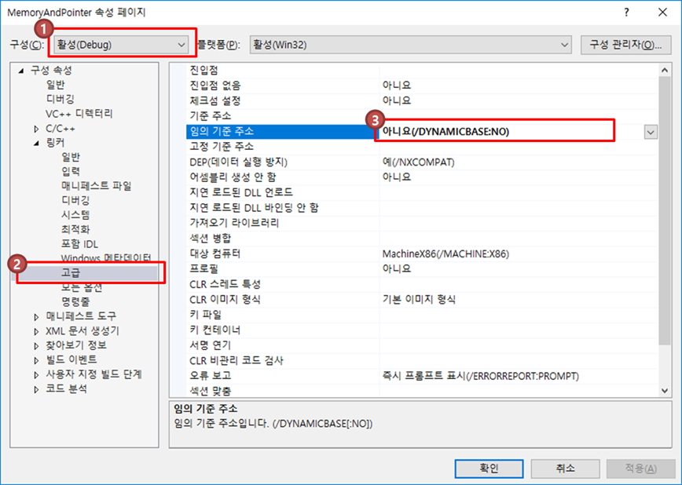
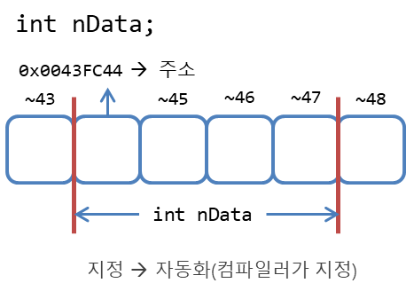
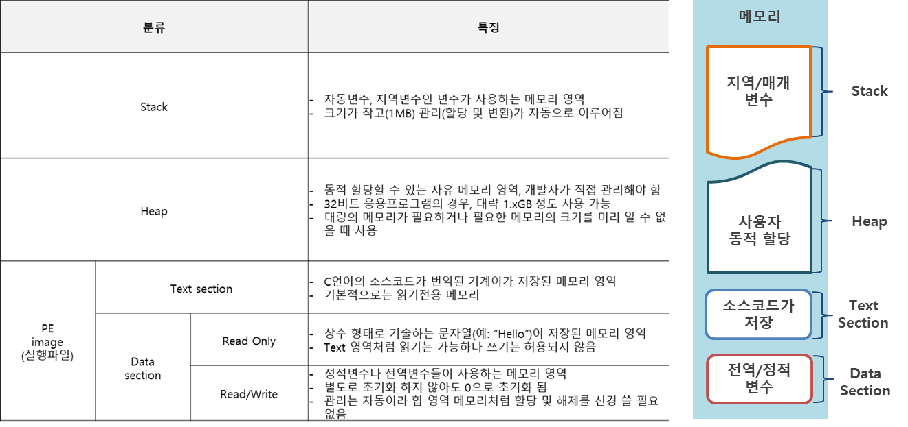
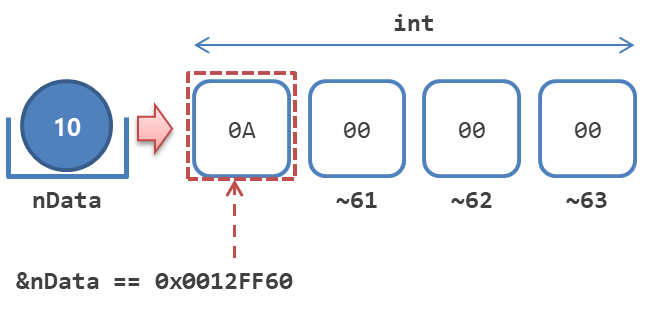
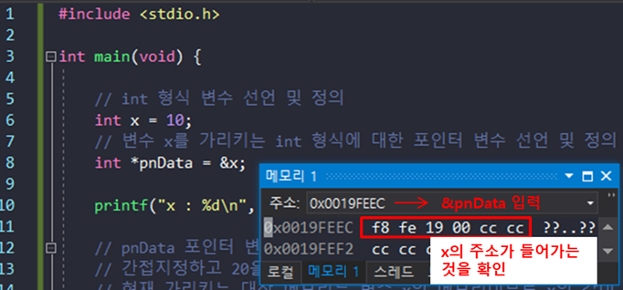
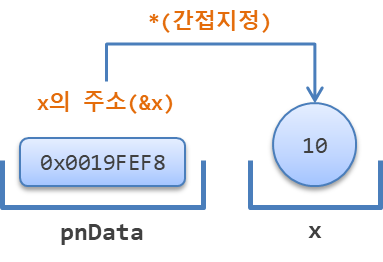
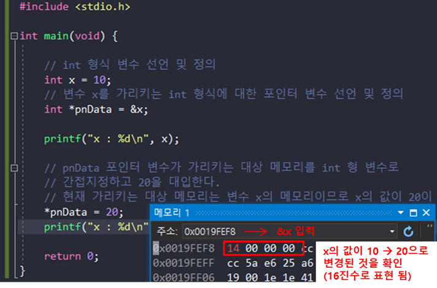
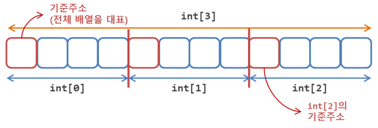

# Chap11 - 메모리와 포인터

드디어 C언어의 꽃인 포인터다. 

이번 장에서 실습을 제대로 하기 위해서는 몇가지 설정이 필요하다. 우선 나는 Chap02 ~ Chap10까지는 Linux, Mac OS에서 실습을 하여 [gcc](https://gcc.gnu.org/)로 컴파일하였다. 하지만, 이번 장에서 포인터에 대해 실습할 때는 Windows 환경에서 [Visual Studio 2017](https://www.visualstudio.com/ko/downloads/)을 이용하여 실습을 진행하였다. 

Visual Studio에서 새로운 프로젝트를 생성한 후 `Alt + F7` 를 눌러 프로젝트의 속성을 다음과 같이 수정해야 한다.

- [구성 속성] → [링커] → [고급] 에서 '임의 기준 주소' 옵션을 '**아니요(/DYNAMICBASE:NO)**' 로 설정해줘야 한다.
- 그 이유는 Windows7 이후 부터는 **ASLR**(Address Space Layout Randomization)을 지원하기 때문에 프로그램을 실행할 때마다 메모리 주소가 변경된다. 실습에서 메모리 주소를 고정해주기 위해 '아니요'로 설정한다.




## 11.1 컴퓨터와 메모리

**변수의 본질은 메모리이며 모든 메모리는 자신의 위치를 식별하기 위한 근거로 고유번호(일련번호)를 갖는데, 이 번호를 메모리의 주소**라 한다. 32비트 응용프로그램에서 1바이트 단위 메모리에 부여된 일련번호는 부호가 없는 32비트 정수이며, 보통 16진수로 표기한다.


주소로 메모리를 식별하는 것은 low-level 특성이며, high-level에서는 주소보다는 이름(식별자)으로 식별한다. 따라서, 변수의 선언 및 정의는 메모리 확보를 의미하며, 선언 시 부여한 이름으로 확보한 메모리를 식별한다.

변수를 이루는 세 가지 요소는 다음과 같다. 

- 이름이 부여된 메모리
- 그 안에 담긴 정보
- 메모리의 주소




다음 예제코드는 단항 연산자인 **주소 번지 연산자**(주소 연산자)를 이용해 해당 변수의 이름 즉, **변수의 메모리 주소**를 출력하는 코드이다.

```c
// pointer01.c

#include <stdio.h>

int main(void){
    
    int nData = 10;
    printf("%s\n", "nData");

    // 변수 nData에 들어 있는 값을 출력
    printf("%d\n", nData);
    // 변수 nData의 메모리 주소를 출력
    printf("%p\n", &nData);  // %p: pointer, 16진수로 출력
    return 0;
}
/* 출력결과
nData
10
0061FF2C
*/
```


위의 코드를 요약하면 아래와 같다

> "변수명이 `nData`인 부호가 없는 32비트 정수형 메모리의 실제 주소는 `0x0061FF2c`이고, 그 안에 저장된 정보는 10진 정수인 `10`이다."


### 11.1.1 메모리의 종류

메모리는 용도에 따라 스택(stack), 힙(heap), 데이터 영역(data section), 텍스트 영역(text section)등으로 나눌 수 있다.




### 11.1.2 포인터 변수의 선언 및 정의

포인터 변수는 **메모리의 주소를 저장하기 위한 전용 변수** 이다. 메모리의 주소는 집주소처럼 위치정보로 생각할 수 있으며, 포인터를 "주소가 적힌 메모지"로 생각할 수 있다.

메모리의 주소는 단항 연산자인 주소 연산자를 사용하여 컴파일 시 해당 변수의 메모리 주소를 알 수 있다. 예를 들어 `&nData` 라는 연산은 "변수명이 `nData`인 메모리의 실제 주소는?"이라는 의미이다. 

그러면, 이번에는 **주소 연산과 정반대되는 개념의 연산자인 '간접지정 연산자(`*`)'**에 대해 알아보자. 여기서 '지정'이라는 말은 임의 대상 메모리에 대한 길이와 해석방법 즉, **자료형을 지정한다**는 의미이다. 예를 들어 아래의 그림과 같이 메모리의 주소가 `0x0012FF60`인 메모리를 `int`형으로 지정한다는 뜻은 총 네 바이트의 메모리(`0x0012FF60~63` 인 메모리 덩어리)를 한 세트로 보고 `int`형 변수로 취급한다는 뜻이다.




따라서, 자료형이란 **"일정 길이(또는 크기)의 메모리에 저장된 정보를 해석하는 방법"**이다.

위의 그림처럼 `int`형 변수를 지정하는 방법은 '직접지정'과 '간접지정'이 있는데, 직접지정은 `int nData;` 처럼 변수명으로 선언 및정의하는 방법을 말한다. **간접지정은 변경될 수 있는 임의의 기준주소로 상대적인 위치(주소)를 식별하는 방식**이며, 어떤 **기준을 근거로 상대인 메모리의 위치를 설명하는 방법**을 말한다.

아래의 예제는 포인터 변수의 선언 및 정의 그리고 간접지정 연산자와 주소 연산자의 사용에 대한 예제코드 이다.

```c
#include <stdio.h>

int main(void)
{

    // int 형식 변수 선언 및 정의
    int x = 10;
    // 변수 x를 가리키는 int 형식에 대한 포인터 변수 선언 및 정의
    int *pnData = &x;

    printf("x : %d\n", x);

    // pnData 포인터 변수가 가리키는 대상 메모리를 int 형 변수로
    // 간접지정하고 20을 대입한다.
    // 현재 가리키는 대상 메모리는 변수 x의 메모리이므로 x의 값이 20이 된다.
    *pnData = 20;
    printf("x : %d\n", x);

    // pnData를 출력해보자
    printf("pnData의 값 : %p\n", pnData);
    printf("x의 주소(&x) : %p\n", &x);

    /* 
    즉, pnData의 값은 x의 메모리 주소(&x)이므로 
    이것을 간접연산자 *를 통해 변수 x라고 식별하고
    여기에 *pnData = 20 이라고 해주는 것은
    x = 20이라는 것과 같은 것이 된다.
    */

    return 0;
}

/* 출력결과
x : 10
x : 20
pnData의 값 : 0019FEF8
x의 주소(&x) : 0019FEF8
*/
```


위의 예제를 직접 확인 하려면 Visual Studio 2017에서 다음과 같이 실행해주면 된다.

- `int *pnData = &x;` 행에 위치 중단점을 설정(`F9`)하고,
- 디버그 모드로 실행(`F5`) 한 다음
- 메모리를 직접 조사(`Alt + 6`)한다.
- 메모리 창의 주소창에 `&pnData`입력한 뒤
- `F10`을 눌러 결과를 확인한다.




위의 코드에서 `*pnData`의 의미는 **"포인터 변수 `pnData`에 저장된 주소를 가진 메모리를 `int`형 변수로 취급한다."** 라는 뜻이다. 




디버깅 모드에서 `F10`을 눌러 `*pnData` 부분을 실행해 주면 아래와 같이 `x`의 메모리 주소의 값이 변경된 것을 확인할 수 있다.




### 11.1.3 포인터와 배열

배열의 이름은 0번 요소의 주소이며, 전체 배열을 대표하는 식별자이다. 포인터 변수는 주소를 저장하기 위한 변수이므로 **"배열의 이름이 주소이므로, 포인터 변수에 저장할 수 있다."** 라는 추론이 가능하다. 즉, `int`형 포인터에 `int`형 변수의 주소만 담을 수 있는 것이 아니라, `int`형 배열의 이름도 담을 수 있다.




```c
// ptrnarray01.c

#include <stdio.h>

int main(void){
    // int 배열 선언 및 정의. 배열의 이름은 연속된 각 요소들 중
    // 전체를 대표하는 0번째 요소에 대한 '주소 상수'이다.
    int aList[5] = { 0 };
    // int에 대한 포인터 변수를 배열의 이름으로 정의한다.
    int *pnData = aList;  // => int *pnData = &aList[0];

    // 배열의 0번 요소의 값을 출력한다.
    printf("aList[0] : %d\n", aList[0]);

    // 포인터가 가리키고 있는 배열의 0번 요소의 값을 변경하고 출력한다.
    *pnData = 20;
    printf("aList[0] : %d\n", aList[0]);
    printf("pnData[0] : %d\n", pnData[0]);

    return 0;
}

/* 출력결과
aList[0] : 0
aList[0] : 20
pnData[0] : 20
*/
```


위의 코드에서 `int *pnData = aList` 부분은 `int`형 배열의 이름을 "`int`에 대한 포인터의 초기값"으로 정의했다. 이 부분을 `int *pnData = &aList[0]`라고도 할 수 있다. 또한 `int *pnData = &aList[1](또는 &aList[2])` 처럼 지정하여 배열의 특정 index의 주소로 정의할 수도 있다. `*pnData=20;`에서 `*pnData`는 간접지정 연산자이며 "`pnData`포인터에 저장된 수소의 메모리를 `int`형 변수로 지정"한 것이다.

마지막으로,  `printf("pnData[0] : %d\n", pnData[0]);` 에서의 결과값은 `aList[0]`의 값과 같다. 그 이유는 `*pnData = aList`에서 **포인터 변수 `pnData`에 저장된 주소를 기준으로 오른쪽으로 `int` 0 개 떨어진 위치(주소)의 메모리를 `int`형 변수로 지정한다**는 의미이기 때문이다. 따라서 `*pnData = 20`를 **`*(pnData + 0) = 20`** 로 쓸 수 있으며, 이 것은 또한 **`pnData[0]`** 과 같다.

다음 예제는 배열에 저장된 문자열의 길이를 측정하는 프로그램을 포인터 변수에 저장된 주소값을 증가시키는 방법으로 구현한 것이다.

```c
// ptrstring01.c
#include <stdio.h>
// strlen() 함수를 사용하기 위한 헤더 포함
#include <string.h>

int main(void){

    // 문자 배열(char[16])의 선언 및 정의
    // 선언한 크기는 char[16]이지만 초기화는 char[6] 문자열로 한다.
    char szBuffer[16] = { "Hello" };
    // 문자 배열을 가리키는 문자 포인터 변수의 선언 및 정의
    char *pszData = szBuffer;
    int nLength = 0;

    // pszData 포인터 변수가 가리키는 대상에 저장된 char형 데이터가
    // 문자열의 끝을 의미하는 NULL 문자가 될 때까지 반복문 수행
    while(*pszData != '\0'){
        pszData++;
        nLength++;
    }

    // strlen() 함수로 문자열의 길이(바이트 단위 크기)를 출력한다.
    printf("Length : %d\n", nLength);
    printf("Length : %d\n", strlen(szBuffer));
    printf("Length : %d\n", strlen("World"));

    return 0;
}
/* 출력결과
Length : 5
Length : 5
Length : 5
*/
```