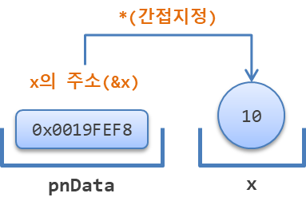
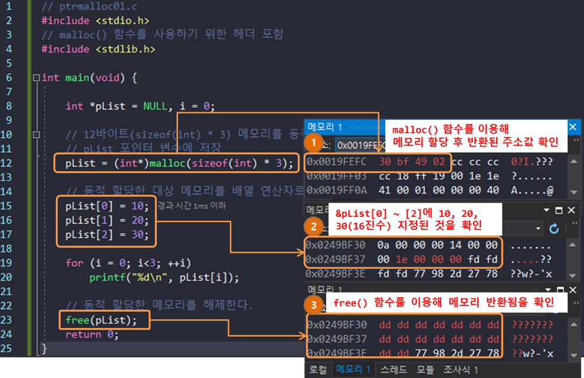
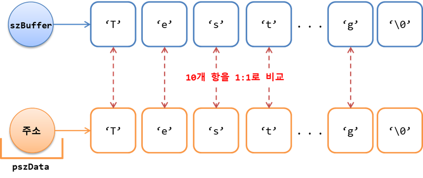
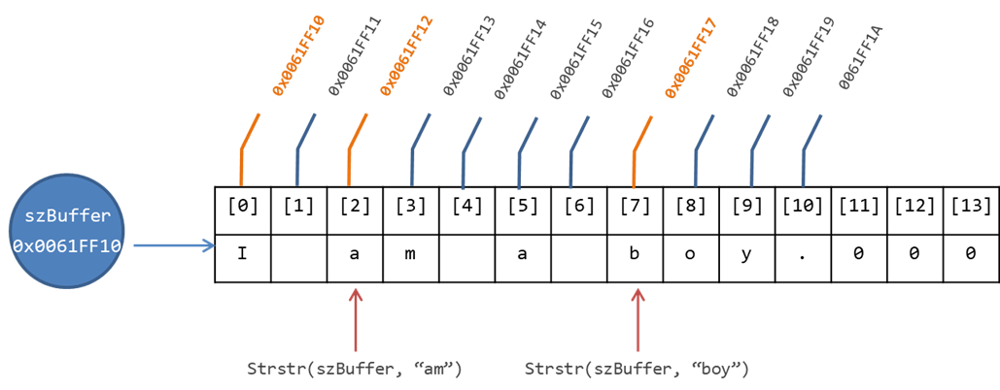
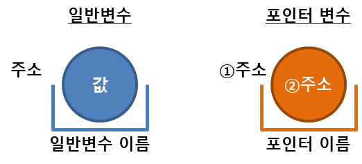
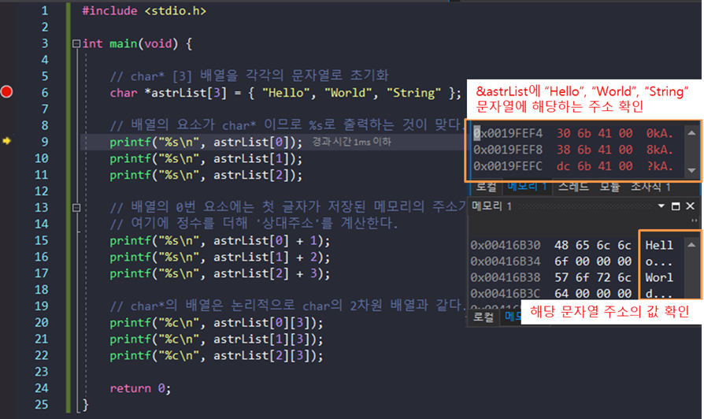
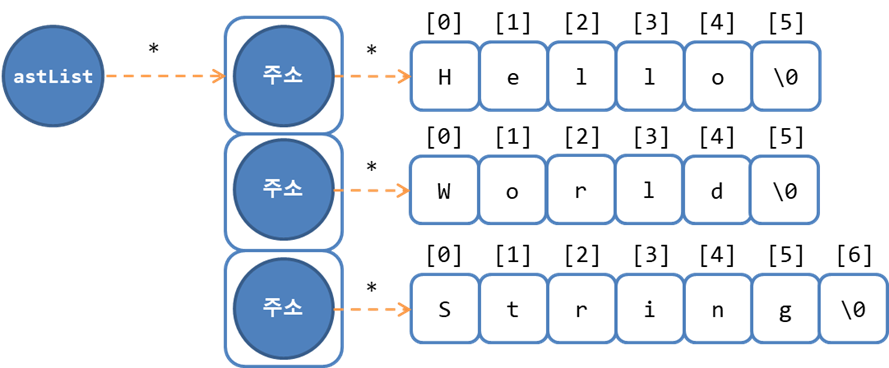
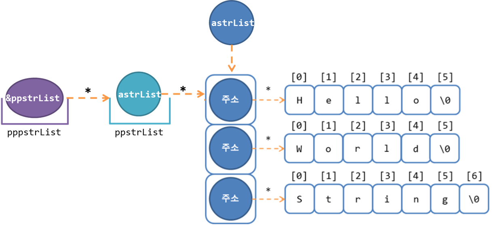

# Chap11 - 메모리와 포인터

드디어 C언어의 꽃인 포인터다. 

이번 장에서 실습을 제대로 하기 위해서는 몇가지 설정이 필요하다. 우선 나는 Chap02 ~ Chap10까지는 Linux, Mac OS에서 실습을 하여 [gcc](https://gcc.gnu.org/)로 컴파일하였다. 하지만, 이번 장에서 포인터에 대해 실습할 때는 Windows 환경에서 [Visual Studio 2017](https://www.visualstudio.com/ko/downloads/)을 이용하여 실습을 진행하였다. 

Visual Studio에서 새로운 프로젝트를 생성한 후 `Alt + F7` 를 눌러 프로젝트의 속성을 다음과 같이 수정해야 한다.

- [구성 속성] → [링커] → [고급] 에서 '임의 기준 주소' 옵션을 '**아니요(/DYNAMICBASE:NO)**' 로 설정해줘야 한다.
- 그 이유는 Windows7 이후 부터는 **ASLR**(Address Space Layout Randomization)을 지원하기 때문에 프로그램을 실행할 때마다 메모리 주소가 변경된다. 실습에서 메모리 주소를 고정해주기 위해 '아니요'로 설정한다.


## 11.1 컴퓨터와 메모리

**변수의 본질은 메모리이며 모든 메모리는 자신의 위치를 식별하기 위한 근거로 고유번호(일련번호)를 갖는데, 이 번호를 메모리의 주소**라 한다. 32비트 응용프로그램에서 1바이트 단위 메모리에 부여된 일련번호는 부호가 없는 32비트 정수이며, 보통 16진수로 표기한다.


주소로 메모리를 식별하는 것은 low-level 특성이며, high-level에서는 주소보다는 이름(식별자)으로 식별한다. 따라서, 변수의 선언 및 정의는 메모리 확보를 의미하며, 선언 시 부여한 이름으로 확보한 메모리를 식별한다.

변수를 이루는 세 가지 요소는 다음과 같다. 

- 이름이 부여된 메모리
- 그 안에 담긴 정보
- 메모리의 주소


다음 예제코드는 단항 연산자인 **주소 번지 연산자**(주소 연산자)를 이용해 해당 변수의 이름 즉, **변수의 메모리 주소**를 출력하는 코드이다.

```c
// pointer01.c

#include <stdio.h>

int main(void){
    
    int nData = 10;
    printf("%s\n", "nData");

    // 변수 nData에 들어 있는 값을 출력
    printf("%d\n", nData);
    // 변수 nData의 메모리 주소를 출력
    printf("%p\n", &nData);  // %p: pointer, 16진수로 출력
    return 0;
}
/* 출력결과
nData
10
0061FF2C
*/
```


위의 코드를 요약하면 아래와 같다

> "변수명이 `nData`인 부호가 없는 32비트 정수형 메모리의 실제 주소는 `0x0061FF2c`이고, 그 안에 저장된 정보는 10진 정수인 `10`이다."


### 11.1.1 메모리의 종류

메모리는 용도에 따라 스택(stack), 힙(heap), 데이터 영역(data section), 텍스트 영역(text section)등으로 나눌 수 있다.


### 11.1.2 포인터 변수의 선언 및 정의

포인터 변수는 **메모리의 주소를 저장하기 위한 전용 변수** 이다. 메모리의 주소는 집주소처럼 위치정보로 생각할 수 있으며, 포인터를 "주소가 적힌 메모지"로 생각할 수 있다.

메모리의 주소는 단항 연산자인 주소 연산자를 사용하여 컴파일 시 해당 변수의 메모리 주소를 알 수 있다. 예를 들어 `&nData` 라는 연산은 "변수명이 `nData`인 메모리의 실제 주소는?"이라는 의미이다. 

그러면, 이번에는 **주소 연산과 정반대되는 개념의 연산자인 '간접지정 연산자(`*`)'**에 대해 알아보자. 여기서 '지정'이라는 말은 임의 대상 메모리에 대한 길이와 해석방법 즉, **자료형을 지정한다**는 의미이다. 예를 들어 아래의 그림과 같이 메모리의 주소가 `0x0012FF60`인 메모리를 `int`형으로 지정한다는 뜻은 총 네 바이트의 메모리(`0x0012FF60~63` 인 메모리 덩어리)를 한 세트로 보고 `int`형 변수로 취급한다는 뜻이다.


따라서, 자료형이란 **"일정 길이(또는 크기)의 메모리에 저장된 정보를 해석하는 방법"**이다.

위의 그림처럼 `int`형 변수를 지정하는 방법은 '직접지정'과 '간접지정'이 있는데, 직접지정은 `int nData;` 처럼 변수명으로 선언 및정의하는 방법을 말한다. **간접지정은 변경될 수 있는 임의의 기준주소로 상대적인 위치(주소)를 식별하는 방식**이며, 어떤 **기준을 근거로 상대인 메모리의 위치를 설명하는 방법**을 말한다.

아래의 예제는 포인터 변수의 선언 및 정의 그리고 간접지정 연산자와 주소 연산자의 사용에 대한 예제코드 이다.

```c
#include <stdio.h>

int main(void)
{

    // int 형식 변수 선언 및 정의
    int x = 10;
    // 변수 x를 가리키는 int 형식에 대한 포인터 변수 선언 및 정의
    int *pnData = &x;

    printf("x : %d\n", x);

    // pnData 포인터 변수가 가리키는 대상 메모리를 int 형 변수로
    // 간접지정하고 20을 대입한다.
    // 현재 가리키는 대상 메모리는 변수 x의 메모리이므로 x의 값이 20이 된다.
    *pnData = 20;
    printf("x : %d\n", x);

    // pnData를 출력해보자
    printf("pnData의 값 : %p\n", pnData);
    printf("x의 주소(&x) : %p\n", &x);

    /* 
    즉, pnData의 값은 x의 메모리 주소(&x)이므로 
    이것을 간접연산자 *를 통해 변수 x라고 식별하고
    여기에 *pnData = 20 이라고 해주는 것은
    x = 20이라는 것과 같은 것이 된다.
    */

    return 0;
}

/* 출력결과
x : 10
x : 20
pnData의 값 : 0019FEF8
x의 주소(&x) : 0019FEF8
*/
```


위의 예제를 직접 확인 하려면 Visual Studio 2017에서 다음과 같이 실행해주면 된다.

- `int *pnData = &x;` 행에 위치 중단점을 설정(`F9`)하고,
- 디버그 모드로 실행(`F5`) 한 다음
- 메모리를 직접 조사(`Alt + 6`)한다.
- 메모리 창의 주소창에 `&pnData`입력한 뒤
- `F10`을 눌러 결과를 확인한다.


위의 코드에서 `*pnData`의 의미는 **"포인터 변수 `pnData`에 저장된 주소를 가진 메모리를 `int`형 변수로 취급한다."** 라는 뜻이다. 




디버깅 모드에서 `F10`을 눌러 `*pnData` 부분을 실행해 주면 아래와 같이 `x`의 메모리 주소의 값이 변경된 것을 확인할 수 있다.


### 11.1.3 포인터와 배열

배열의 이름은 0번 요소의 주소이며, 전체 배열을 대표하는 식별자이다. 포인터 변수는 주소를 저장하기 위한 변수이므로 **"배열의 이름이 주소이므로, 포인터 변수에 저장할 수 있다."** 라는 추론이 가능하다. 즉, `int`형 포인터에 `int`형 변수의 주소만 담을 수 있는 것이 아니라, `int`형 배열의 이름도 담을 수 있다.


```c
// ptrnarray01.c

#include <stdio.h>

int main(void){
    // int 배열 선언 및 정의. 배열의 이름은 연속된 각 요소들 중
    // 전체를 대표하는 0번째 요소에 대한 '주소 상수'이다.
    int aList[5] = { 0 };
    // int에 대한 포인터 변수를 배열의 이름으로 정의한다.
    int *pnData = aList;  // => int *pnData = &aList[0];

    // 배열의 0번 요소의 값을 출력한다.
    printf("aList[0] : %d\n", aList[0]);

    // 포인터가 가리키고 있는 배열의 0번 요소의 값을 변경하고 출력한다.
    *pnData = 20;
    printf("aList[0] : %d\n", aList[0]);
    printf("pnData[0] : %d\n", pnData[0]);

    return 0;
}

/* 출력결과
aList[0] : 0
aList[0] : 20
pnData[0] : 20
*/
```


위의 코드에서 `int *pnData = aList` 부분은 `int`형 배열의 이름을 "`int`에 대한 포인터의 초기값"으로 정의했다. 이 부분을 `int *pnData = &aList[0]`라고도 할 수 있다. 또한 `int *pnData = &aList[1](또는 &aList[2])` 처럼 지정하여 배열의 특정 index의 주소로 정의할 수도 있다. `*pnData=20;`에서 `*pnData`는 간접지정 연산자이며 "`pnData`포인터에 저장된 수소의 메모리를 `int`형 변수로 지정"한 것이다.

마지막으로,  `printf("pnData[0] : %d\n", pnData[0]);` 에서의 결과값은 `aList[0]`의 값과 같다. 그 이유는 `*pnData = aList`에서 **포인터 변수 `pnData`에 저장된 주소를 기준으로 오른쪽으로 `int` 0 개 떨어진 위치(주소)의 메모리를 `int`형 변수로 지정한다**는 의미이기 때문이다. 따라서 `*pnData = 20`를 **`*(pnData + 0) = 20`** 로 쓸 수 있으며, 이 것은 또한 **`pnData[0]`** 과 같다.

다음 예제는 배열에 저장된 문자열의 길이를 측정하는 프로그램을 포인터 변수에 저장된 주소값을 증가시키는 방법으로 구현한 것이다.

```c
// ptrstring01.c
#include <stdio.h>
// strlen() 함수를 사용하기 위한 헤더 포함
#include <string.h>

int main(void){

    // 문자 배열(char[16])의 선언 및 정의
    // 선언한 크기는 char[16]이지만 초기화는 char[6] 문자열로 한다.
    char szBuffer[16] = { "Hello" };
    // 문자 배열을 가리키는 문자 포인터 변수의 선언 및 정의
    char *pszData = szBuffer;
    int nLength = 0;

    // pszData 포인터 변수가 가리키는 대상에 저장된 char형 데이터가
    // 문자열의 끝을 의미하는 NULL 문자가 될 때까지 반복문 수행
    while(*pszData != '\0'){
        pszData++;
        nLength++;
    }

    // strlen() 함수로 문자열의 길이(바이트 단위 크기)를 출력한다.
    printf("Length : %d\n", nLength);
    printf("Length : %d\n", strlen(szBuffer));
    printf("Length : %d\n", strlen("World"));

    return 0;
}
/* 출력결과
Length : 5
Length : 5
Length : 5
*/
```


## 11.2 메모리 동적 할당 및 관리

지금까지 예제코드에서 봐온 변수들은 메모리를 할당하고 해제하는 과정을 컴파일러가 자동으로 관리해주기 때문에 메모리 관리에 신경을 쓰지 않아도 됐었다. 그래서 이러한 변수들을 자동변수라고 불렀다.

그렇다면, 이제 메모리 동적 할당 및 관리에 대해 알아보자. `malloc()`과 `free()`함수는 메모리를 동적으로 할당 및 해제하는 함수다.

`malloc()` 함수를 이용하면 자동변수로 사용할 수 있는 메모리와는 비교할 수도 없을 만큼 큰 메모리를 자유롭게 '동적(dynamic)'으로 다룰 수 있다. 즉, 프로그램 실행 중에 대량의 메모리가 필요한 경우 바로 할당이 가능하다. 대신 이러한 할당에는 **반환(또는 해제)**을 해주어야 한다.


- **`void *malloc(size_t size);`**
  - **Description** : 할당받은 메모리는 반드시 `free()`함수를 이용해 반환해야하며, 메모리를 초기화하려면 `memset()`함수를 이용해야한다. 기본적으로는 쓰레기값이 들어있다.
  - **Parameters** : size - 할당받을 메모리의 바이트 단위 크기
  - **Return** : 힙(heap) 영역에 할당된 메모리 덩어리 중 첫 번째 바이트 메모리의 주소, 에러 발생 시 NULL 반환


- **`void free(void *memblock)`**

  - **Description** : 동적으로 할당받은 메모리를 운영체제에 반환하는 함수

  - **Parameters** : memblock - 반환할 메모리의 주소

  - **Return** : 없음


**`malloc()` 함수는 인수로 전달받은 정수만큼의 바이트 단위 메모리를 동적으로 할당하고 주소를 반환**한다. 이 주소는 할당받은 메모리 전체에 대한 **기준주소**이다. 메모리의 사용이 끝난 다음에는 반드시 **`free()`함수를 이용해 메모리를 운영체제에 반환**해야 한다. 

다음 예제는 `malloc(), free()` 함수를 이용해 포인터 변수인 `pList`에 메모리를 동적할당한 후 반환하는 코드다.

```c
// ptrmalloc01.c
#include <stdio.h>
// malloc() 함수를 사용하기 위한 헤더 포함
#include <stdlib.h>

int main(void){

    int *pList = NULL, i = 0;

    // 12바이트(sizeof(int) * 3) 메모리를 동적 할당하고 시작주소를
    // pList 포인터 변수에 저장
    pList = (int*)malloc(sizeof(int)*3);

    // 동적 할당한 대상 메모리를 배열 연산자로 접근한다.
    pList[0] = 10;  // *(pList + 0) = 10;
    pList[1] = 20;
    pList[2] = 30;

    for(i=0; i<3; ++i)
        printf("%d\n", pList[i]);
    
    // 동적 할당한 메모리를 해제한다.
    free(pList);
    return 0;
}
/*
출력결과
10
20
30
*/
```


위의 코드를 디버깅모드를 통해 메모리를 조사해보면 아래의 그림처럼 확인할 수 있다.



만약에 위의 코드에서 `free(pList);`를 주석으로 처리한 후 실행하면 에러는 발생하지 않지만, 할당 받은 메모리를 반환하지 않아, **메모리 누수(memory leak)**가 발생하게 된다. 


### 11.2.1 메모리 초기화 및 사용(배열)

할당된 메모리는 일단 `0`으로 초기화하는 것이 바람직하다. 그 이유는 메모리를 할당할때 운영체제에서 할당할 메모리를 빌려오는 것이기 때문에 할당될 메모리안에 어떠한 값이 들어 있는지 모르기 때문이다. `memset()`과 `calloc()` 함수를 이용해 할당받은 메모리를 초기화할 수 있다.

- **`void *memset(void *dest, int c, size_t count)`**
  - **Description** : 동적으로 할당받은 메모리에는 쓰레기 값이 있으므로 일반적으로 0으로 초기화하여 사용
  - **Parameters** : 
    - dest - 초기화할 대상 메모리 주소
    - c - 초기값, 이 값이 0이면 메모리를 0으로 초기화
    - count - 초기화 대상 메모리의 바이트 단위 크기
  - **Return** : 대상 메모리 주소


- **`void *calloc(size_t num, size_t size)`**
  - **Description** : `malloc()`함수와 달리 할당받은 메모리를 0으로 초기화하여 전달한다. 할당받은 메모리는 반드시 `free()` 함수를 이용하여 반환해야한다.
  - **Parameters** :
    - num - 요소의 개수
    - size - 각 요소의 바이트 단위 크기
  - **Return** : 힙(heap) 영역에 할당된 메모리 덩어리 중 첫 번째 바이트 메모리의 주소. 할당된 메모리의 크기는 `num * size`의 값이다. 에러가 발생하면 NULL 반환


```c
// ptrmeminit01.c
#include <stdio.h>
// malloc(), calloc() 함수를 위한 헤더 포함
#include <stdlib.h>
// memset() 함수를 위한 헤더 포함
#include <string.h>

int main(void){
    int *pList = NULL, *pNewList = NULL;

    // A. int형 3개 배열 선언 및 정의(0 초기화)
    int aList[3] = { 0 };

    // B. int형 3개를 담을 수 있는 크기의 메모리를 동적으로 할당한 후
    // 메모리를 모두 0으로 초기화
    pList = (int*)malloc(sizeof(int) * 3);
    memset(pList, 0, sizeof(int) * 3);

    // C. int형 3개를 담을 수 있는 메모리를 0으로 초기화한 후 할당받음
    pNewList = (int*)calloc(3, sizeof(int));

    for(int i=0; i<3; ++i)
        printf("pList[%d]의 값 : %d\n", i, pList[i]);

    for (int i = 0; i < 3; ++i)
        printf("pNewList[%d]의 값 : %d\n", i, pNewList[i]);

    // 동적 할당한 메모리들을 해제
    free(pList);
    free(pNewList);
    return 0;
}
/* 출력결과
pList[0]의 값 : 0
pList[1]의 값 : 0
pList[2]의 값 : 0
pNewList[0]의 값 : 0
pNewList[1]의 값 : 0
pNewList[2]의 값 : 0
*/
```


위의 코드를 디버깅모드를 통해 메모리를 조사해보면 아래의 그림처럼 확인할 수 있다.


### 11.2.2 메모리 복사

예를 들어 `int num = 10;` 처럼 단순 대입연산자는 오른쪽 `r-value`값인 `10`을 왼쪽 피연산자인 `num` 즉, `l-value`에 복사한다. 이 과정에서 `num`의 기존 정보는 유실되고 새로운 정보로 덮어 씌어진다. 이러한 단순 대입 연산에서 피연산자가 변수(`l-value`)일 경우, 그 개수가 1개라고 전제하여 그 1개에 대해 대입이 이루어진다. 

반면, **배열처럼** 여러 인스턴스가  있는 경우에는 단순 대입으로 `r-value`를 `l-value`로 복사할 수가 없다. 따라서, 배열에 대입 연산을 수행하려면 각 요소의 개수만큼 `for`문이나 `while`문을 통해 요소별로 일일이 대입 연산을 수행해야한다. 하지만, `memcpy()`함수를 사용하여 이러한 귀찮은 작업을 대신할 수 있다.

- **`void *memcpy(void *dest, const void *src, size_t count)`**
  - **Description** : 특정 주소로 시작하는 일정 길이의 메모리에 저장된 값을 대상 메모리에 그대로 복사해준다.
  - **Parameters** :
    - dest - 대상 메모리 주소
    - src - 복사할 원본 데이터가 저장된 메모리 주소
    - count - 복사할 메모리의 바이트 단위 크기
  - **Return** : 대상 메모리 주소


```c
// ptrmemcpy01.c
#include <stdio.h>
// memcpy() 함수를 위한 헤더포함
#include <string.h>

int main(void){
    char szBuffer[12] = { "HelloWorld" };
    char szNewBuffer[12] = { 0 };

    // 원본에서 4 바이트만 대상 메모리로 복사
    memcpy(szNewBuffer, szBuffer, 4);
    puts(szNewBuffer);

    // 원본에서 6 바이트만 대상 메모리로 복사
    memcpy(szNewBuffer, szBuffer, 6);
    puts(szNewBuffer);

    // 원본 메모리 전체를 대상 메모리로 복사
    memcpy(szNewBuffer, szBuffer, sizeof(szBuffer));
    puts(szNewBuffer);
    return 0;
}
/* 출력결과
Hell
HelloW
HelloWorld
*/
```


### 11.2.3 메모리 비교(`memcmp(), strcmp()`)

#### `memcmp()`

- **`int memcmp(const void *buf1, const void *buf2, size_t count);`**
  - **Description** : 첫 번째 인자로 전달된 주소의 메모리에 저장된 값에서 두 번째 인자로 전달된 주소에 저장된 메모리의 값을 빼서 두 값이 같은지 비교한다. 즉, 주어진 길이만큼 두 메모리를 비교하는 함수이다.
  - **Parameters** : 
    - buf1 - 비교 원본 메모리 주소
    - buf2 - 비교 대상 메모리 주소
    - count - 비교할 메모리의 바이트 단위 크기
  - **Return** :
    - 0 - 두 값이 같음
    - $>$ 0 - buf1이 buf2 보다 더 큼
    - $<$ 0 - buf2가 buf1보다 더 큼


```c
// ptrmemcmp01.c

#include <stdio.h>
#include <string.h>

int main(void){

    char szBuffer[12] = {"TestString"};
    char *pszData = "TestString";

    // 두 메모리에 저장된 값이 같은 경우
    printf("%d\n", memcmp(szBuffer, pszData, 10));

    // 왼쪽("teststring")이 더 큰 경우 ASCII 숫자상 t > T이기 때문
    printf("%d\n", memcmp("teststring", pszData, 10));

    // 오른쪽(pszData)이 더 큰 경우
    printf("%d\n", memcmp("DataString", pszData, 10));

    return 0;
}
/*출력결과
0
1
-1
*/
```


`memcmp()`함수는 아래의 그림처럼 메모리 하나 하나를 1:1로 비교해 메모리를 비교한다.




#### `strcmp()`

먼저, `strcmp()`함수를 알아보기 전에 다음 예제를 살펴보자. 

```c
// ptrstrcmp01.c

#include <stdio.h>

int main(void){

    char szBuffer[12] = { "TestString" };
    char *pszData = "TestString";

    // 다음 코드들은 두 문자열이 같은지 비교하는 것이 아니라
    // 문자열이 저장된 메모리의 위치가 같은지 비교하는 것이다.
    printf("%d\n", szBuffer == pszData);
    printf("%d\n", "TestString" == pszData);
    printf("%d\n", "DataString" == "TestString");
    return 0;
}
/* 출력결과
0
1
0
*/
```


위의 코드를 작성한 의도는 두 문자열이 같은지를 비교하기 위해 작성한 것이다. 하지만, 문자열은 배열이므로, 배열의 이름은 **주소** 다. 따라서 위의 `==` 부분은 모두 **주소가 같은 주소인지 비교하는** 것이다. 따라서, 주소를 비교하는 것이 아닌 문자열 내용을 비교하기 위해서는 `strcmp()`함수를 이용하면 된다.

- **`strcmp(const char *string1, const char *string2);`**
  - **Description** : 대소문자를 식별하여 두 문자열이 같은지 비교하는 함수
  - **Parameters** : 
    - string1 - 비교할 문자열이 저장된 메모리 주소
    - string2 - 비교할 문자열이 저장된 메모리 주소
  - **Return** : 
    - 0 - 두 문자열이 같음
    - $>$ 0 - string1이 sting2보다 알파벳 순서상 나중
    - $<$ 0 - string2가 나중


위의 `ptrstrcmp01.c` 코드를 다음과 같이 수정하면 문자열 내용을 비교할 수 있다.

```c
// ptrstrcmp02.c

#include <stdio.h>
#include <string.h>

int main(void)
{

    char szBuffer[12] = {"TestString"};
    char *pszData = "TestString";

    // 다음 코드들은 두 문자열이 같은지 비교하는 것이 아니라
    // 문자열이 저장된 메모리의 위치가 같은지 비교하는 것이다.
    printf("%d\n", strcmp(szBuffer, pszData));
    printf("%d\n", strcmp("TestString", pszData));
    printf("%d\n", strcmp("Test", "TestString"));
    return 0;
}
/* 출력결과
0
0
-1
*/
```


### 11.2.4 문자열 검색

`strstr()`함수는 두 문자열의 주소를 인자로 받아 검색하여 결과를 반환해 주는 함수이다.

- **`char strstr(const char *string, const char *strCharSet)`**
  - **Description** : 임의의 대상 문자열에서 특정 문자열을 검색하는 함수
  - **Parameters** :
    - string - 검색 대상이 될 문자열이 저장된 메모리 주소
    - strCharSet - 검색할 문자열이 저장된 메모리 주소
  - **Return** : 
    - 문자열을 찾으면 해당 문자열이 저장된 메모리 주소 반환
    - 찾지 못하면 `NULL` 반환

```c
// ptrsearch01.c

#include <stdio.h>
#include <string.h>

int main(void){

    char szBuffer[32] = { "I am a boy." };

    // 배열의 주소를 출력한다.
    printf("%p\n", szBuffer);

    // 대상 문자열에서 문자열을 검색하고 찾은 위치(주소)를 출력한다.
    printf("%p\n", strstr(szBuffer, "am"));
    printf("%p\n", strstr(szBuffer, "boy"));

    // 문자열이 검색된 위치에서 기준이 되는 주소를 빼면
    // 인덱스를 계산할 수 있다.
    printf("Index: %d\n", strstr(szBuffer, "am") - szBuffer);
    printf("Index: %d\n", strstr(szBuffer, "boy") - szBuffer);
    return 0;
}
/* 출력결과 
0061FF10
0061FF12
0061FF17
Index: 2
Index: 7
*/
```


위의 코드를 `szBuffer` 배열의 그림으로 나타내면 아래와 같다.




### 11.2.5 배열 연산자 풀어쓰기

1차원 배열을 포인터 관점으로 보면, **기준주소에서 일정 인덱스만큼 떨어진 상대주소를 배열 요소의 변수로 지정하는 연산**이라 할 수 있다. 즉 , **`*(기준주소 + 인덱스)`** 와 **`기준주소[인덱스]`**는 같은 의미이다.

```c
// ptrnarray02.c

#include <stdio.h>
#include <string.h>

int main(void){

    char szBuffer[32] = { "You are a girl." };

    // 배열의 첫 번째(0번) 요소의 값을 %c 형식으로 출력한다.
    printf("%c\n", szBuffer[0]);
    // 0번 요소에 대한 주소인 배열의 이름(주소)에 대해 간접지정 연산을
    // 수행하고 그 안에 담긴 정보를 출력한다.
    printf("%c\n", *szBuffer);
    // 0을 더하더라도 주소는 달라지지 않는다.
    printf("%c\n", *(szBuffer + 0));
    
    // 배열 연산자는 '기준주소 + 인덱스' 연산결과로 얻은 주소를
    // 간접지정한 것과 같다.
    printf("%c\n", szBuffer[5]);
    printf("%c\n", *(szBuffer + 5));

    // 주소연산(&)은 간접지정 연산과 상반된다.szBuffer
    // 그러므로 아래 세줄의 코드는 모두 같다.
    printf("%s\n", &szBuffer[4]);
    printf("%s\n", &*(szBuffer + 4));
    printf("%s\n", szBuffer + 4);
    printf("%p\n", szBuffer + 4);

    return 0;
}
/* 출력결과
Y
Y
Y
r
r
are a girl.
are a girl.
are a girl.
0061FF14
*/
```


위의 코드에서  `%s`는 배열의 주소에 대응하는 형식문자이다.  `printf()` 함수는 `%s`와 대응된 인자를 메모리의 주소로 판단하고 그 주소에서 `0`이 나올 때 까지 한 글자씩 읽어와 문자열로 출력한다. 즉, **`%s`는 배열의 이름과 대응**된다.


### 11.2.6 `realloc(), sprintf()` 함수

`realloc()`함수는 **이미 할당된 메모리를 이름처럼 재할당하는 함수**이다. 

- **`void *realloc(void *memblock, size_t size);`**
  - **Description** : 이미 할당된 메모리 영역에서 크기를 조정할 수 있다면, 반환된 주소는 첫 번째 인자로 전달된 주소와 같다.  불가능할 경우 기존의 메모리를 해제하고 새로운 영역에 다시 할당한 후, 새로 할당된 메모리의 주소를 반환한다.
  - **Parameters** :
    - memblock - 기존에 동적 할당된 메모리 주소. 만약 이 주소가 `NULL`이면 `malloc()`함수와 동일하게 동작
    - size - 다시 할당받을 메모리의 바이트 단위 크기
  - **Return** : 다시 할당된 메모리 덩어리 중 첫 번째 바이트의 메모리 주소. 실패할 경우 `NULL` 반환 


`sprintf()`함수는 `printf()` 함수와 비슷하지만, 문자열이 콘솔에 출력되는 것이 아니라 특정 주소의 메모리에 출력된다.  `strcpy()` 함수와 유사한 기능을 한다. 

- **`int sprintf(char *buffer, const char *format [, argument] ...)`**
  - **Description** : 형식 문자열에 맞춰 특정 메모리에 문자열을 저장하는 함수
  - **Parameters** : 
    - buffer - 출력 문자열이 저장될 메모리 주소
    - format - 형식 문자열이 저장된 메모리 주소
    - [, argument] - 형식 문자열에 대응하는 가변 인자들
  - **Return** : 출력된 문자열의 개수


`strcpy(), sprintf()` 함수는 보안결함이 있어, Windows 에서는 `strcpy_s(), sprintf_s()` 함수를 사용하는 것이 좋으며 `Linux, UNIX` 에서는 `strncpy(), snprintf()`를 사용하는 것이 좋다.

다음 예제는 12 바이트의 메모리를 동적 할당한 후 메모리에 문자열을 출력(`sprintf()`)하고, 더 긴 문자열 출력을 위해 32바이트로 늘려(`realloc()`) 다른 문자열을 출력하는 코드이다.

```c
// ptrrealloc01.c

#include <stdio.h>
// _msize() 함수를 위한 헤더 포함
#include <malloc.h>
#include <string.h>

int main(void){

    char *pszBuffer = NULL, *pszNewBuffer = NULL;

    // 12바이트 메모리를 동적 할당한 후
    pszBuffer = (char*)malloc(12);
    // NULL 문자를 포함해 영문 11자를 저장한다.
    sprintf(pszBuffer, "%s", "TestString");
    // 동적할 메모리의 주소, 크기, 저장된 문자열 등을 출력한다.
    printf("[%p] %d %s\n", pszBuffer, _msize(pszBuffer), pszBuffer);

    // 12바이트의 메모리를 32바이트로 '확장'을 시도한다.
    pszNewBuffer = (char*)realloc(pszBuffer, 32);
    if (pszNewBuffer == NULL)
        free(pszBuffer);
    
    // 문자열을 덮어쓰고 주소, 메모리 크기, 저장된 내용을 확인한다.
    sprintf(pszNewBuffer, "%s", "TestStringData");
    printf("[%p] %d %s\n", pszNewBuffer, _msize(pszNewBuffer), pszNewBuffer);

    free(pszNewBuffer);
    return 0;
}
/* 출력결과
[02721C70] 12 TestString
[02721C70] 32 TestStringData
*/
```


위의 출력결과에서 `malloc()`함수를 이용해 12바이트 메모리를 할당한 메모리 주소와 `realloc()`를 이용해 32바이트로 메모리를 확장한 메모리 주소는 `0x02721C70`으로 같음을 알 수 있다. 


## 11.3 포인터의 배열과 다중 포인터

포인터 또한 그 자체도 **변수(메모리)**이다. 변수는 메모리이고 메모리는 관리 목적의 고유번호 즉, 주소가 부여되어 있다. 일반적인 변수의 경우, 이름, 주소, 그 안에 저장된 데이터가 명확하게 구분된다. 하지만 **포인터는 변수 자체의 주소와 변수에 저장된 주소, 이렇게 두 개의 주소가 공존** 한다.




다중 포인터 또한 일반 포인터와 다를 것이 없으며, 가리키는 것이 포인터 변수일 뿐이다. 예를 들어, `int`형 변수에 대한 포인터는 `int*`이며, `int*` 변수에 대한 포인터는 `int**` 이다.

| 포인터 자료형 | 간접지정 연산결과      | 코드 예                                        |
| ------------- | ---------------------- | ---------------------------------------------- |
| `char*`       | `*(char*) == char`     | `int nData = 10;`<br />`int *pnData = &nData;` |
| `char* *`     | `*(char**) == char*`   | `int* *ppnData = &pnData;`                     |
| `char** *`    | `*(char***) == char**` | `int** *pppnData = &ppnData;`                  |


### 11.3.1 `char*`의 배열

다중 포인터가 등장하는 이유는 '포인터의 배열' 때문이다. 포인터 배열이란 배열의 요소가 포인터 변수인 경우를 말한다. 예를 들어, `char`형 배열은 문자(배)열 이며 이 문자열은 `0`번 요소의 주소로 식별된다. 따라서, 배열을 식별하는 주소는 **배열(ex. `char[5]`)을 이루고 있는 요소 자료형(`char`)에 대한 포인터(`char*`)**에 담는다.

```c
#include <stdio.h>

int main(void){

    // char* [3] 배열을 각각의 문자열로 초기화
    char *astrList[3] = { "Hello", "World", "String" };

    // 배열의 요소가 char* 이므로 %s로 출력하는 것이 맞다.
    printf("%s\n", astrList[0]);
    printf("%s\n", astrList[1]);
    printf("%s\n", astrList[2]);

    // 배열의 0번 요소에는 첫 글자가 저장된 메모리의 주소가 들어있다.
    // 여기에 정수를 더해 '상대주소'를 계산한다.
    printf("%s\n", astrList[0] + 1);
    printf("%s\n", astrList[1] + 2);
    printf("%s\n", astrList[2] + 3);

    // char*의 배열은 논리적으로 char의 2차원 배열과 같다.
    printf("%c\n", astrList[0][3]);
    printf("%c\n", astrList[1][3]);
    printf("%c\n", astrList[2][3]);

    return 0;
}
/* 출력결과 
Hello
World
String
ello
rld
ing
l
l
i
*/
```




위의 코드를 그림으로 나타내면 다음과 같다.




### 11.4.2 다중 포인터

다음 예제는 포인터에 대한 포인터 변수를 선언 및 정의한 다중 포인터 예제이다. 

```c
// arrayofptr03.c
#include <stdio.h>

int main(int argc, char* argv[]){
    char* astrList[3] = { "Hello", "World", "String" };
    // astrList의 요소 형식이 char* 이므로 char**에 담는다.
    char* *ppstrList = astrList;
    // char** 형식 변수의 주소는 char***에 담는다.
    char** *pppstrList = &ppstrList;

    // *(char** + 인덱스)의 형식은 char*이다.
    // 따라서 %s로 출력하거나 puts()로 출력한다.
    puts(ppstrList[0]);
    puts(ppstrList[1]);
    puts(ppstrList[2]);

    // char***를 두 번 간접지정하면 char*이다.
    puts(*pppstrList[0]);
    puts(*(*(pppstrList + 0) + 1));
    return 0;
}
/* 출력결과
Hello
World
String
Hello
World
 */
```




### 11.4.3 다차원 배열에 대한 포인터

2차원 배열은 **원소가 배열인 배열**이다. 따라서 `char[3][16]` 배열은 `char[16]`가 원소(요소)이고 개수가 3인 배열이며, `char[3][16]` 배열의 식별자인 주소를 담을 수 있는 포인터 변수는 `char[16] *` 이다.  하지만 이렇게 하면 **문법오류** 이다.  문법오류가 나지 않게 하려면 아래의 예제 코드처럼 해주면 된다.

```c
// ptrtoarray01.c
#include <stdio.h>

int main(int argc, char* argv[]){

    char astrList[2][12] = {"Hello", "World"};

    // char* *ptrList = astrList;
    char (*pstrList)[12] = astrList;

    puts(astrList[0]);
    puts(astrList[1]);

    return 0;
}
/* 출력결과
Hello
World
 */
```


## 11.5 변수와 메모리

변수의 본질은 메모리이며, 변수를 선언한다는 것은 함수 내부에 속한 지역변수를 의미하며, 지역변수는 [11.1- 메모리의 종류](http://excelsior-cjh.tistory.com/146?category=999958) 에서 살펴 보았듯이, 메모리 중에서 스택(stack) 영역이다.  스택 주고의 메모리는 관리가 자동으로 이루어지므로, 스택을 사용하는 변수를 자동변수라고 한다.


변수를 선언할 때는 어떤 메모리를 쓸 것인지 명시를 해줘야 하지만, **명시를 하지 않을 경우 지역변수는 컴파일러가 알아서 모두 자동변수로 처리**한다. 변수를 선언할 때 자료형 앞에 기억부류(storage-class)를 명시하는 예약어를 **기억부류 지정자(storage-class specifier)** 라고 한다. 

C언어의 기억부류 지정자는 `extern, auto, static, register` 등이 있다. 

```c
// variable01.c

#include <stdio.h>

int main(int argc, char* argv[]){

    auto int aList[3] = {10, 20, 30};
    auto int i = 0;

    for(i=0; i<3; ++i)
        printf("%d\t", aList[i]);
    return 0;
}
/*  출력결과
10	20	30
 */
```

위의 코드에서 `auto`는 생략해도 된다. 생략하게 되면 컴파일러가 자동으로 스코프 내부의 변수들은 `auto`로 처리한다.


### 11.5.1 정적변수 `static`

정적변수가 사용하는 데이터 영역 메모리는 프로그램이 시작될 때 확보되어 종료될 때까지 그대로 유지된다. 따라서 함수가 호출되어 스코프가 닫힌다 해도 메모리가 사라지는 것이 아니기 때문에 데이터는 그대로 유지가 되는 것이다.

```c
// variable02.c
#include <stdio.h>

int TestFunc(void){

    // 접근성은 TestFunc() 내부로 제한된 지역변수이나
    // 기억부류는 스택이 아니라 데이터 영역인 '정적'변수 선언 및 정의
    // 정의는 이 함수가 여러번 호출 되더라도 단 한번만 적용된다.
    static int nData = 10;

    // nData의 값이 변경됐다.
    // 정적변수이므로 이 변경된 값은 함수가 반환하더라도 유지된다.
    ++nData;
    return nData;
}

int main(int argc, char* argv[]){
    // TestFunc() 함수를 호출할 때마다 다른 nData 값을 반환 받는다.
    printf("%d\n", TestFunc());
    printf("%d\n", TestFunc());
    printf("%d\n", TestFunc());
    return 0;
}
/* 출력결과
11
12
13
 */
```

 

위의 코드에서 처럼, 정적변수를 사용하려면 반드시 `static`을 붙여야 한다. 그리고 함수가 반환되도 메모리가 사라지지 않으므로 `nData` 변수는 전역변수처럼 그대로 존재하게 된다. 


### 11.5.2 레지스터 변수 `register`

레지스터 변수는 CPU의 레지스터를 사용하기 위한 변수이다. 일반 메모리가 아닌 CPU가 가진 메모리 이므로, **별도의 주소가 없다.** 

```c
// variable03.c

#include <stdio.h>

int main(int argc, char* argv[]){
    
    register int i = 0;
    printf("%d\n", i);
    printf("%p\n", &i);  // <- 레지스터 변수는 주소가 없으므로 에러가 남
    return 0;
}
```

